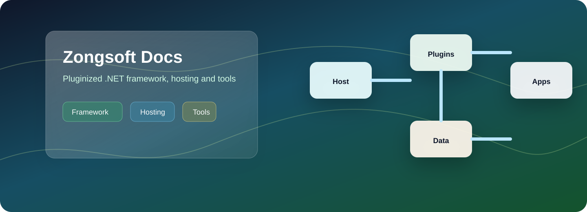

# Zongsoft 开发框架

Zongsoft 是一组面向 .NET 的开源框架、宿主程序和开发工具，核心目标是帮助团队构建可插件化、可部署、可维护的业务应用。

它由三部分共同组成：



### 开发框架

提供核心抽象、插件框架、数据引擎、Web 基础、安全、诊断、消息、自动升级以及常见第三方服务适配。



### 宿主与工具

宿主程序负责承载插件式应用；工具链负责部署插件、制作安装包、发布升级包和辅助开发调试。



## 快速导航

<table data-card-size="large" data-view="cards">
	<thead>
		<tr>
			<th>主题</th>
			<th>说明</th>
			<th data-hidden data-card-target data-type="content-ref">页面</th>
			<th data-hidden data-card-cover data-type="image">封面</th>
		</tr>
	</thead>
	<tbody>
		<tr>
			<td><strong>了解整体设计</strong></td>
			<td>从框架、宿主和工具链的边界开始建立全局图景。</td>
			<td><a href="overview/what-is-zongsoft.md">what-is-zongsoft.md</a></td>
			<td><a href=".gitbook/assets/zongsoft-docs-cover.svg">zongsoft-docs-cover.svg</a></td>
		</tr>
		<tr>
			<td><strong>从本地环境开始</strong></td>
			<td>准备 SDK、源码、目录和可选容器环境。</td>
			<td><a href="get-started/prerequisites.md">prerequisites.md</a></td>
			<td><a href=".gitbook/assets/zongsoft-start-cover.svg">zongsoft-start-cover.svg</a></td>
		</tr>
		<tr>
			<td><strong>理解插件化应用</strong></td>
			<td>理解插件树、构件、服务注册和宿主集成。</td>
			<td><a href="framework/plugins/">plugins</a></td>
			<td><a href=".gitbook/assets/zongsoft-plugins-cover.svg">zongsoft-plugins-cover.svg</a></td>
		</tr>
		<tr>
			<td><strong>学习数据访问</strong></td>
			<td>用数据模式、映射文件和驱动完成对象图读写。</td>
			<td><a href="framework/data/">data</a></td>
			<td><a href=".gitbook/assets/zongsoft-data-cover.svg">zongsoft-data-cover.svg</a></td>
		</tr>
	</tbody>
</table>

## 阅读路径

如果你是第一次接触 Zongsoft，建议按下面顺序阅读：

1. 从 [什么是 Zongsoft](overview/what-is-zongsoft.md) 了解整体边界。
2. 阅读 [插件化](overview/pluginization.md)，理解业务能力为什么以插件方式组织。
3. 按 [准备环境](get-started/prerequisites.md) 和 [安装包](get-started/install.md) 完成本地准备。
4. 选择一个 [宿主程序](get-started/hosting.md)，再部署第一个插件。
5. 进入框架指南，按需要阅读核心类库、插件框架、数据引擎、Web 基础等主题。


本文档优先以“如何构建一个插件式应用”的路径组织内容，而不是按 NuGet 包逐个罗列。包名、源码路径和模块关系可以在 [包与模块索引](references/packages.md) 中查阅。

