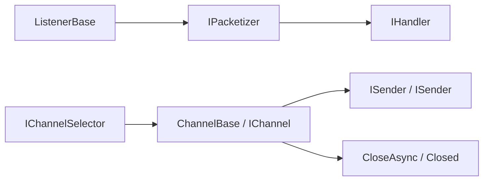

# 常规通讯

常规通讯抽象把“如何发送、如何接收、如何监听、如何关闭通道、如何打包拆包”拆成几组小接口。核心框架只定义协议边界，具体网络连接、消息队列连接、事件通道等实现由 `Zongsoft.Net`、`Zongsoft.Messaging.*` 或其它扩展项目承接。

## 类型关系

| 类型 | 说明 |
| --- | --- |
| `ISender` | 发送字节数据。 |
| `ISender<T>` | 发送强类型数据包。 |
| `IReceiver` | 接收 [`ReadOnlySequence<byte>`](https://learn.microsoft.com/zh-cn/dotnet/api/system.buffers.readonlysequence-1) _[源码](https://source.dot.net/#System.Memory/ReadOnlySequence.cs)_ 字节序列。 |
| `IListener<T>` | 监听并处理强类型通讯包。 |
| `ListenerBase<T>` | 监听器基类，实现接收、拆包和交给处理器的流程。 |
| `IChannel` | 可关闭、可异步释放的通讯通道。 |
| `ChannelBase` | 通道基类，统一关闭状态、关闭事件和释放流程。 |
| `IChannelSelector<T>` | 根据键选择一个通道。 |
| `IPacketizer<TPackage>` | 强类型通讯包的打包和拆包接口。 |
| `IPacketizer<TRequest, TResponse>` | 请求/应答模式下的请求打包和响应拆包接口。 |


源码中没有独立的 `Listener` 类型；当前监听器概念由 `IListener<T>` 和 `ListenerBase<T>` 承载，`Zongsoft.Net.TcpServer<T>` 是一个典型实现。


## Channel 设计思想

`Channel` 是“通讯端点”的生命周期抽象，而不是某一种协议的代名词。它表达的是：这个端点是否关闭、如何关闭、关闭后如何通知外部，以及是否可以被选择器或管理器持有。



这个设计让不同通讯形态可以共享同一个生命周期词汇：

* TCP 连接通道：`TcpChannelBase<T>` 继承 `ChannelBase`，同时实现 `ISender` 和 `ISender<T>`。
* 事件通道：`IEventChannel` 继承 `IChannel` 和 `ISender<EventContext>`，可把事件发送到远端。
* 消息队列通道：`ZeroQueueEventChannel` 继承 `ChannelBase`，把事件编码后投递到 ZeroMQ 队列。
* 消息消费者：`MessageConsumerBase<TQueue>` 继承 `ChannelBase`，把订阅生命周期也纳入通道关闭模型。

## 接收与拆包

`ListenerBase<T>` 实现了从字节到强类型包的模板流程：收到字节序列后调用 `IPacketizer<T>.Unpack`，拆包成功后再调用处理器。

来源：[framework/Zongsoft.Core/src/Communication/ListenerBase.cs](https://github.com/Zongsoft/framework/blob/main/Zongsoft.Core/src/Communication/ListenerBase.cs#L61)（节选；上下文见源文件）。


```csharp
protected virtual ValueTask OnReceiveAsync(in ReadOnlySequence<byte> data, CancellationToken cancellation)
{
	var message = data;

	if(this.OnDeserialize(ref message, out var value))
	{
		var task = this.OnHandleAsync(value, cancellation);

		if(!task.IsCompletedSuccessfully)
			return new ValueTask(task.AsTask());
	}

	return ValueTask.CompletedTask;
}
```


`IPacketizer<T>` 适合处理粘包、半包、长度头、压缩、加密和自定义二进制协议。它的 `Unpack` 接收 `ref ReadOnlySequence<byte>`，实现者可以在拆出一个包后推进序列，让上层继续处理缓冲区中的后续包。

来源：[framework/Zongsoft.Core/src/Communication/IPacketizer.cs](https://github.com/Zongsoft/framework/blob/main/Zongsoft.Core/src/Communication/IPacketizer.cs#L39)（节选；上下文见源文件）。


```csharp
public interface IPacketizer<TPackage>
{
	/// <summary>打包，将通讯包对象序列化到发送缓存。</summary>
	/// <param name="writer">缓存写入器。</param>
	/// <param name="package">待打包的通讯包。</param>
	void Pack(IBufferWriter<byte> writer, in TPackage package);

	/// <summary>拆包，将字节流反序列化成通讯包对象。</summary>
	/// <param name="data">待拆包的字节流。</param>
	/// <param name="package">拆包成功的通讯包。</param>
	/// <returns>如果拆包完成则返回真(<c>True</c>)，否则返回假(<c>False</c>)。</returns>
	bool Unpack(ref ReadOnlySequence<byte> data, out TPackage package);
}
```


## Zongsoft.Net 中的实现

`Zongsoft.Net` 把这些抽象落到 TCP 网络通讯上：

* `TcpServer<T>` 继承 `ListenerBase<T>`，持有 `IPacketizer<T>`，负责监听并创建 TCP 通道。
* `TcpChannelBase<T>` 继承 `ChannelBase`，负责单连接的发送、接收、打包、拆包和关闭。
* `TcpServerChannelManager<T>` 维护服务端通道集合，并在客户端连接时创建通道。
* `Packetizer` 提供无头包和长度头包两种基础拆包实现。

来源：[framework/Zongsoft.Net/samples/server/Program.cs](https://github.com/Zongsoft/framework/blob/main/Zongsoft.Net/samples/server/Program.cs#L18)（节选；上下文见源文件）。


```csharp
var server = TcpServer.Headed;
server.Handler = new Handler(server);
await server.StartAsync(args.Length == 0 ? ["127.0.0.1", "7969"] : args);
```


上面来自 framework 的 TCP 服务端样例；Handler 是同一 Program.cs 的内部类型，接收文本后广播 ACK 回复。Discussions 没有直接托管 TCP 通道。配套客户端、启动参数和关闭行为见[网络通讯](../../net.md)。

## 现实场景

通道模型适合任何“有打开/关闭生命周期，并可发送或接收数据”的场景。网络连接只是其中一种；事件总线、消息队列订阅、设备连接、网关会话也可以成为通道。

<details>
<summary>什么时候需要实现自己的 Channel</summary>

* 需要管理一条可关闭的远端连接，例如 WebSocket、TCP、串口或设备会话。
* 需要把消息队列订阅封装成可释放对象。
* 需要统一处理关闭事件，避免调用方直接依赖底层驱动。
* 需要通过 `IChannelSelector<T>` 根据租户、用户、设备或主题选择发送通道。

</details>

## 相关资源

* [ISender.cs](https://github.com/Zongsoft/framework/blob/main/Zongsoft.Core/src/Communication/ISender.cs)
* [ISender&lt;T&gt;.cs](https://github.com/Zongsoft/framework/blob/main/Zongsoft.Core/src/Communication/ISender%601.cs)
* [IReceiver.cs](https://github.com/Zongsoft/framework/blob/main/Zongsoft.Core/src/Communication/IReceiver.cs)
* [IListener.cs](https://github.com/Zongsoft/framework/blob/main/Zongsoft.Core/src/Communication/IListener.cs)
* [ListenerBase.cs](https://github.com/Zongsoft/framework/blob/main/Zongsoft.Core/src/Communication/ListenerBase.cs)
* [IChannel.cs](https://github.com/Zongsoft/framework/blob/main/Zongsoft.Core/src/Communication/IChannel.cs)
* [ChannelBase.cs](https://github.com/Zongsoft/framework/blob/main/Zongsoft.Core/src/Communication/ChannelBase.cs)
* [IChannelSelector.cs](https://github.com/Zongsoft/framework/blob/main/Zongsoft.Core/src/Communication/IChannelSelector.cs)
* [IPacketizer.cs](https://github.com/Zongsoft/framework/blob/main/Zongsoft.Core/src/Communication/IPacketizer.cs)
* [Zongsoft.Net README](https://github.com/Zongsoft/framework/blob/main/Zongsoft.Net/README.md)
* [TcpChannelBase.cs](https://github.com/Zongsoft/framework/blob/main/Zongsoft.Net/src/TcpChannelBase.cs)
* [ZeroQueueEventChannel.cs](https://github.com/Zongsoft/framework/blob/main/messaging/zero/src/ZeroQueueEventChannel.cs)
