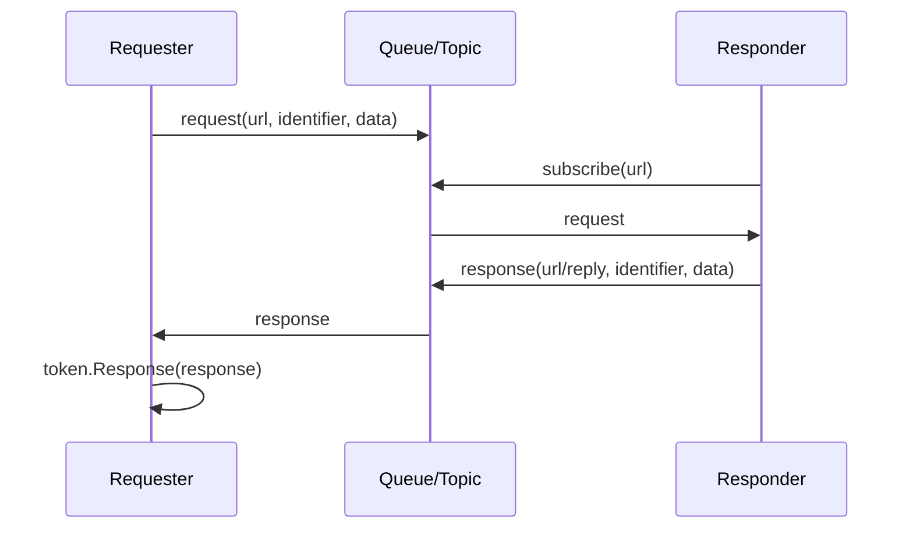

# 请求应答

请求应答抽象用于消息型通讯中的“发起请求、等待一个或多个响应、按请求标识关联结果”。它不是 HTTP 请求模型，也不是只能一问一答；一次请求可以收到多次响应，调用方通过 `IRequestToken` 获取已到达的响应。

## 类型关系

| 类型 | 说明 |
| --- | --- |
| `IRequest` | 请求对象，包含 `Url`、`Identifier` 和请求数据。 |
| `IRequestToken` | 请求令牌，负责枚举当前请求对应的响应。 |
| `IRequester` | 请求发起方，负责发送请求并接收响应回调。 |
| `IResponder` | 请求处理方，负责接收请求并发送响应。 |
| `IResponse` | 响应对象，包含响应地址、响应数据和关联请求。 |

## 它解决什么问题

消息队列、ZeroMQ、事件总线这类系统通常没有天然的同步返回值。请求应答模型把一次业务请求拆成三件事：

1. 请求方发送带 `Identifier` 的请求消息。
2. 响应方处理请求，并把同一个 `Identifier` 写回响应消息。
3. 请求方收到响应后，根据 `Identifier` 找到请求令牌，把响应放入令牌。



## 发起请求

Discussions 的 HTTP 控制器不使用这组请求应答抽象。下面采用 ZeroMQ 已有的 rpc/echo 测试：ZeroServerScope 启动测试 Broker，两个队列分别负责请求与应答，EchoHandler 原样返回载荷。完整测试依赖同目录夹具，并受 Global.IsTestingEnabled 开关控制。

请求方调用 `RequestAsync` 后会得到 `IRequestToken`。这个 token 不是响应本身，而是响应收集器；调用方可以立即枚举已到达的响应，也可以给一个等待时长。

来源：[framework/messaging/zero/test/ZeroRequesterTests.cs](https://github.com/Zongsoft/framework/blob/main/messaging/zero/test/ZeroRequesterTests.cs#L16)（节选；上下文见源文件）。


```csharp
public async Task RequesterReceivesImmediateResponses()
{
	if(!Global.IsTestingEnabled)
		return;

	using var server = await ZeroServerScope.StartAsync();
	using var requesterQueue = ZeroTestUtility.CreateQueue(server.Port, "requester");
	using var responderQueue = ZeroTestUtility.CreateQueue(server.Port, "responder");

	var responder = new ZeroResponder { Queue = responderQueue };
	responder.Handlers.Add(new EchoHandler());
	await responder.StartAsync([]);

	try
	{
		await using var requester = new ZeroRequester { Queue = requesterQueue };

		for(int i = 0; i < 20; i++)
		{
			using var token = await requester.RequestAsync("rpc/echo", Encoding.UTF8.GetBytes($"message-{i}"));
			Assert.NotNull(token);

			var response = token.GetResponses(TimeSpan.FromSeconds(5)).FirstOrDefault();
			Assert.NotNull(response);
			Assert.Equal($"message-{i}", Encoding.UTF8.GetString(response.Data.Span));
			Assert.Equal(token.Request.Identifier, response.Request.Identifier);
		}
	}
	finally
	{
		await responder.StopAsync([]);
		((IDisposable)responder).Dispose();
	}
}
```


如果业务只允许一个响应，遍历时取第一条即可；如果允许多个服务节点同时响应，就可以把多个响应一起收集、排序、聚合或择优。

## 处理请求并响应

响应方通常把 `IResponder` 注入到请求处理器的参数中，处理器拿到请求后调用 `request.Response(...)` 创建关联响应，再调用 `RespondAsync` 发回。

来源：[framework/messaging/zero/test/ZeroTestUtility.cs](https://github.com/Zongsoft/framework/blob/main/messaging/zero/test/ZeroTestUtility.cs#L357)（节选；上下文见源文件）。


```csharp
[Handler("rpc/echo")]
internal sealed class EchoHandler : HandlerBase<IRequest>
{
	protected override async ValueTask OnHandleAsync(IRequest request, Parameters parameters, CancellationToken cancellation)
	{
		var responder = parameters.GetValue<IResponder>();
		Assert.NotNull(responder);
		await responder.RespondAsync(request.Response(request.Data), cancellation);
	}
}
```


EchoHandler 的路由声明是 rpc/echo，回应由 request.Response(request.Data) 产生，保留请求关联信息。它是测试夹具，不是 Discussions 业务处理器。

## ZeroMQ 实现要点

`messaging/zero` 中的实现可以帮助理解这组接口：

* `ZeroRequest` 把请求标识和请求数据打包成 `identifier + '\n' + data`。
* `ZeroRequester` 先把 token 登记到待处理集合，再在发送请求前订阅 `url + "/reply"`，再向 `url` 投递请求。
* `ZeroResponse` 同样把 `identifier + '\n' + data` 打包到响应消息里。
* `ZeroResponder` 根据处理器 URL 订阅请求主题，收到请求后调用处理器。
* `ZeroRequester.Adapter` 收到响应后解包标识，找到对应 token，并把响应放入 token。

来源：[framework/messaging/zero/src/ZeroRequester.cs](https://github.com/Zongsoft/framework/blob/main/messaging/zero/src/ZeroRequester.cs#L97)（节选；上下文见源文件）。


```csharp
public async ValueTask<IRequestToken> RequestAsync(string url, ReadOnlyMemory<byte> data, CancellationToken cancellation = default)
{
	if(Volatile.Read(ref _disposed) != 0)
		throw new ObjectDisposedException(nameof(ZeroRequester));

	var queue = this.Queue;
	if(queue == null)
		return null;

	var request = new ZeroRequest(url, data);
	var token = new Token(request, request => this.Remove(request.Identifier));

	if(!_tokens.TryAdd(request.Identifier, token))
		return null;

	try
	{
		await this.SubscribeAsync(queue, url + "/reply", cancellation);
		await queue.ProduceAsync(url, request.Pack(), null, cancellation);
		return token;
	}
	catch
	{
		token.Dispose();
		throw;
	}
}
```



`IRequestToken.GetResponses(timeout)` 会在遍历期间等待响应，适合短时等待；长时间监听或实时处理响应时，更适合通过响应处理器处理 `IRequester.OnRespondedAsync` 的回调。


请求登记发生在发送之前，因而即使响应立即到达，适配器也能找到 token。发送或订阅失败时会释放本次 token；同一回复主题的初始化任务会复用。调用方仍应在用完响应后释放 token，不能假定所有无响应请求都会被定时清理；当前过期缓存是在收到响应时设置的。

ZeroRequester 拥有回复订阅和待处理请求，释放它会清理这些资源；它使用的队列由外部提供。已经建立订阅后不允许把 Queue 替换为另一个实例。

## 相关资源

* [IRequest.cs](https://github.com/Zongsoft/framework/blob/main/Zongsoft.Core/src/Communication/IRequest.cs)
* [IRequestToken.cs](https://github.com/Zongsoft/framework/blob/main/Zongsoft.Core/src/Communication/IRequestToken.cs)
* [IRequester.cs](https://github.com/Zongsoft/framework/blob/main/Zongsoft.Core/src/Communication/IRequester.cs)
* [IResponse.cs](https://github.com/Zongsoft/framework/blob/main/Zongsoft.Core/src/Communication/IResponse.cs)
* [IResponder.cs](https://github.com/Zongsoft/framework/blob/main/Zongsoft.Core/src/Communication/IResponder.cs)
* [ZeroRequester.cs](https://github.com/Zongsoft/framework/blob/main/messaging/zero/src/ZeroRequester.cs)
* [ZeroResponder.cs](https://github.com/Zongsoft/framework/blob/main/messaging/zero/src/ZeroResponder.cs)
* [ZeroRequest.cs](https://github.com/Zongsoft/framework/blob/main/messaging/zero/src/ZeroRequest.cs)
* [ZeroResponse.cs](https://github.com/Zongsoft/framework/blob/main/messaging/zero/src/ZeroResponse.cs)
