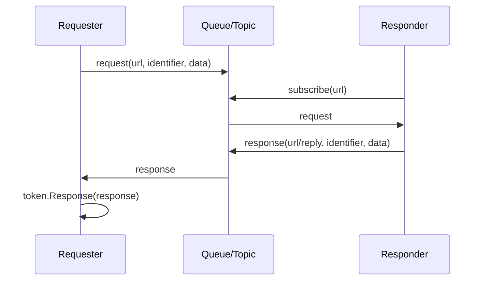

# 请求应答

请求应答抽象用于消息型通讯中的“发起请求、等待一个或多个响应、按请求标识关联结果”。它不是 HTTP 请求模型，也不是只能一问一答；一次请求可以收到多次响应，调用方通过 `IRequestToken` 获取已到达的响应。

## 类型关系

| 类型 | 说明 |
| --- | --- |
| `IRequest` | 请求对象，包含 `Url`、`Identifier` 和请求数据。 |
| `IRequestToken` | 请求令牌，负责枚举当前请求对应的响应。 |
| `IRequester` | 请求发起方，负责发送请求并接收响应回调。 |
| `IResponder` | 请求处理方，负责接收请求并发送响应。 |
| `IResponse` | 响应对象，包含响应地址、响应数据和关联请求。 |

## 它解决什么问题

消息队列、ZeroMQ、事件总线这类系统通常没有天然的同步返回值。请求应答模型把一次业务请求拆成三件事：

1. 请求方发送带 `Identifier` 的请求消息。
2. 响应方处理请求，并把同一个 `Identifier` 写回响应消息。
3. 请求方收到响应后，根据 `Identifier` 找到请求令牌，把响应放入令牌。



## 发起请求

请求方调用 `RequestAsync` 后会得到 `IRequestToken`。这个 token 不是响应本身，而是响应收集器；调用方可以立即枚举已到达的响应，也可以给一个等待时长。


```csharp
using System;
using System.Text;
using Zongsoft.Communication;

IRequester requester = GetRequester();

using var token = await requester.RequestAsync(
	"orders/price",
	Encoding.UTF8.GetBytes("""{"sku":"A100"}"""));

foreach(var response in token.GetResponses(TimeSpan.FromSeconds(3)))
{
	var text = Encoding.UTF8.GetString(response.Data.Span);
	Console.WriteLine(text);
}
```


如果业务只允许一个响应，遍历时取第一条即可；如果允许多个服务节点同时响应，就可以把多个响应一起收集、排序、聚合或择优。

## 处理请求并响应

响应方通常把 `IResponder` 注入到请求处理器的参数中，处理器拿到请求后调用 `request.Response(...)` 创建关联响应，再调用 `RespondAsync` 发回。


```csharp
using System.Threading;
using System.Threading.Tasks;
using System.Text;
using Zongsoft.Collections;
using Zongsoft.Communication;

public async ValueTask HandleAsync(
	IRequest request,
	Parameters parameters,
	CancellationToken cancellation)
{
	if(!parameters.TryGetValue<IResponder>(out var responder))
		return;

	var data = Encoding.UTF8.GetBytes("""{"price":128}""");
	await responder.RespondAsync(request.Response(data), cancellation);
}
```


## ZeroMQ 实现要点

`messaging/zero` 中的实现可以帮助理解这组接口：

* `ZeroRequest` 把请求标识和请求数据打包成 `identifier + '\n' + data`。
* `ZeroRequester` 发送请求前订阅 `url + "/reply"`，再向 `url` 投递请求。
* `ZeroResponse` 同样把 `identifier + '\n' + data` 打包到响应消息里。
* `ZeroResponder` 根据处理器 URL 订阅请求主题，收到请求后调用处理器。
* `ZeroRequester.Adapter` 收到响应后解包标识，找到对应 token，并把响应放入 token。


```csharp
var request = new ZeroRequest(url, data);

await queue.SubscribeAsync(url + "/reply", adapter, cancellation);
await queue.ProduceAsync(url, request.Pack(), null, cancellation);

var token = new Token(request, request => Remove(request.Identifier));
```



`IRequestToken.GetResponses(timeout)` 会在遍历期间等待响应，适合短时等待；长时间监听或实时处理响应时，更适合通过响应处理器处理 `IRequester.OnRespondedAsync` 的回调。


## 相关资源

* [IRequest.cs](https://github.com/Zongsoft/framework/blob/main/Zongsoft.Core/src/Communication/IRequest.cs)
* [IRequestToken.cs](https://github.com/Zongsoft/framework/blob/main/Zongsoft.Core/src/Communication/IRequestToken.cs)
* [IRequester.cs](https://github.com/Zongsoft/framework/blob/main/Zongsoft.Core/src/Communication/IRequester.cs)
* [IResponse.cs](https://github.com/Zongsoft/framework/blob/main/Zongsoft.Core/src/Communication/IResponse.cs)
* [IResponder.cs](https://github.com/Zongsoft/framework/blob/main/Zongsoft.Core/src/Communication/IResponder.cs)
* [ZeroRequester.cs](https://github.com/Zongsoft/framework/blob/main/messaging/zero/src/ZeroRequester.cs)
* [ZeroResponder.cs](https://github.com/Zongsoft/framework/blob/main/messaging/zero/src/ZeroResponder.cs)
* [ZeroRequest.cs](https://github.com/Zongsoft/framework/blob/main/messaging/zero/src/ZeroRequest.cs)
* [ZeroResponse.cs](https://github.com/Zongsoft/framework/blob/main/messaging/zero/src/ZeroResponse.cs)
