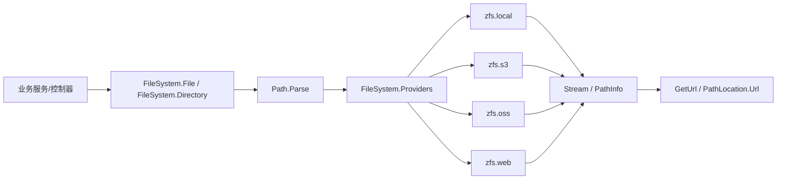

# Zongsoft.IO

`Zongsoft.IO` 是核心库中的虚拟文件系统抽象。它把业务代码中稳定不变的“文件、目录、路径、外部访问地址”抽出来，交给不同的文件系统提供程序去实现：本地磁盘、Amazon S3、阿里云 OSS、HTTP 文件服务，或业务系统自己的存储后端。

它的目标不是隐藏所有底层差异，而是让业务层只依赖一套路径和操作模型：保存时写入一个虚拟路径，读取时通过同一个入口打开流，展示时由 provider 把路径转换为可访问 URL。

## 设计理念

虚拟文件系统围绕三个问题设计：

* 文件放在哪里：由路径中的 `scheme` 和 provider 决定，业务代码不直接关心本地盘符、Bucket、区域或远端 HTTP 地址。
* 文件怎么操作：由 [`IFile`](https://github.com/Zongsoft/framework/blob/main/Zongsoft.Core/src/IO/IFile.cs) 和 [`IDirectory`](https://github.com/Zongsoft/framework/blob/main/Zongsoft.Core/src/IO/IDirectory.cs) 提供统一的创建、删除、打开、枚举、复制、移动接口。
* 文件如何访问：由 [`IFileSystem.GetUrl(...)`](https://github.com/Zongsoft/framework/blob/main/Zongsoft.Core/src/IO/IFileSystem.cs) 把内部路径转换成外部 URL，例如本地路径、预签名 S3 URL、OSS 访问地址或 HTTP 文件服务地址。



这种设计让“业务持久化值”和“外部访问地址”分开：数据库中通常保存 `zfs.oss:/bucket/path/file.jpg` 这样的虚拟路径；对前端返回图片地址时，再通过 `FileSystem.GetUrl(...)` 或 [`PathLocation`](https://github.com/Zongsoft/framework/blob/main/Zongsoft.Core/src/IO/PathLocation.cs) 得到当前环境可访问的 URL。


虚拟路径是稳定引用，外部 URL 是运行时解析结果。对象存储的 URL 可能带签名、过期时间或内外网域名，因此不要把临时访问 URL 当作业务主键长期保存。


## 路径模型

[`Path`](https://github.com/Zongsoft/framework/blob/main/Zongsoft.Core/src/IO/Path.cs) 表示不依赖操作系统的逻辑路径。它由 `scheme`、锚点和路径节组成，路径层级统一使用 `/`。

| 片段 | 示例 | 说明 |
| --- | --- | --- |
| `Scheme` | `zfs.local`、`zfs.s3`、`zfs.oss`、`zfs.web` | 决定由哪个 [`IFileSystem`](https://github.com/Zongsoft/framework/blob/main/Zongsoft.Core/src/IO/IFileSystem.cs) provider 处理。 |
| `FullPath` | `/data/images/avatar.jpg` | 不含 `scheme` 的 provider 内部路径。 |
| `Url` | `zfs.local:/data/images/avatar.jpg` | `scheme:FullPath` 的完整虚拟路径。 |
| `FileName` | `avatar.jpg` | 文件路径最后一节；目录路径以 `/` 结尾，文件名为空。 |
| `Anchor` | `/`、`./`、`../`、`~/` | 根、当前、父级或应用路径锚点。 |

常见路径形式：


```text
zfs.local:/data/attachments/2026/06/photo.jpg
zfs.s3:/bucket@region/images/avatar.jpg
zfs.oss:/bucket/images/avatar.jpg
zfs.web:/files.example.com/images/avatar.jpg
/data/attachments/2026/06/photo.jpg
~/certificates/service.sk
```


`Path.Parse(...)` 会规范化空白和斜杠。Windows 盘符会被视为本地文件系统路径，例如 `D:\data\images\a.jpg` 会解析为 `zfs.local:/D/data/images/a.jpg`，随后由 [`LocalFileSystem`](https://github.com/Zongsoft/framework/blob/main/Zongsoft.Core/src/IO/LocalFileSystem.cs) 还原成本机路径。

`Path.Combine(...)` 用于组合逻辑路径，支持 `.` 和 `..`，也会在遇到绝对路径时从新根开始：


```csharp
using Zongsoft.IO;

var path = Path.Combine("zfs.local:/data/images/", "./avatars", "../photos/001.jpg");
// zfs.local:/data/images/photos/001.jpg
```


## 文件系统门面

[`FileSystem`](https://github.com/Zongsoft/framework/blob/main/Zongsoft.Core/src/IO/FileSystem.cs) 是业务代码最常用的静态入口。

| 成员 | 说明 |
| --- | --- |
| `FileSystem.File` | 文件操作门面，实现 [`IFile`](https://github.com/Zongsoft/framework/blob/main/Zongsoft.Core/src/IO/IFile.cs)。 |
| `FileSystem.Directory` | 目录操作门面，实现 [`IDirectory`](https://github.com/Zongsoft/framework/blob/main/Zongsoft.Core/src/IO/IDirectory.cs)。 |
| `FileSystem.Providers` | 按 `scheme` 保存 provider 的集合，默认包含 `LocalFileSystem.Instance`。 |
| `FileSystem.Scheme` | 未显式指定 `scheme` 时的默认方案；未设置时使用 `zfs.local`。 |
| `FileSystem.GetUrl(...)` | 把虚拟路径转换成外部访问地址；如果传入的本来是 URL，则直接返回。 |

门面调用的路由规则如下：

1. 解析传入的虚拟路径。
2. 如果路径没有 `scheme`，优先使用 `FileSystem.Scheme`；如果仍为空，则使用 `zfs.local`。
3. 如果路径锚点是应用路径 `~/`，直接使用本地文件系统。
4. 从 `FileSystem.Providers` 中按 `scheme` 找到 provider。
5. 把不含 `scheme` 的 `FullPath` 交给 provider 的 `File` 或 `Directory` 实现。


```csharp
using Zongsoft.IO;
using Zongsoft.Externals.Amazon.IO;

FileSystem.Providers.Add(new S3FileSystem(configuration));
FileSystem.Scheme = "zfs.s3";
```


如果业务路径总是带 `scheme`，通常不需要设置默认方案；如果某个应用希望把 `/uploads/...` 统一落到 OSS 或 S3，就可以在启动时设置 `FileSystem.Scheme`。

## 文件操作

[`IFile`](https://github.com/Zongsoft/framework/blob/main/Zongsoft.Core/src/IO/IFile.cs) 表达文件级操作。它的核心是 `Open(...)`：无论底层是磁盘文件、OSS 对象、S3 对象还是 HTTP 上传，都以 `System.IO.Stream` 作为读写边界。


```csharp
using System.IO;
using System.Text;
using Zongsoft.IO;

await using var stream = await FileSystem.File.OpenAsync(
	"zfs.oss:/assets/reports/summary.txt",
	FileMode.Create,
	FileAccess.Write);

await using var writer = new StreamWriter(stream, Encoding.UTF8);
await writer.WriteAsync("Hello Zongsoft.IO");
```


文件复制和移动有一个重要设计：如果源和目标属于同一 `scheme`，门面会调用该 provider 的原生 `Copy`/`Move`；如果属于不同 `scheme`，门面会打开源流和目标流，通过 64KB 缓冲区桥接复制。跨 provider 的 `Move` 等价于“复制成功后删除源文件”。


```csharp
using Zongsoft.IO;

await FileSystem.File.CopyAsync(
	"zfs.local:/D/uploads/photo.jpg",
	"zfs.s3:/bucket@ap-southeast-1/photos/photo.jpg",
	overwrite: true);
```


`GetInfo(...)` 返回 [`FileInfo`](https://github.com/Zongsoft/framework/blob/main/Zongsoft.Core/src/IO/FileInfo.cs)，其中包含路径、名称、大小、MIME 类型、创建时间、修改时间、扩展属性和外部 URL。`FileInfo` 自身也提供 `Delete()`、`Open()`、`Copy()` 等便捷方法，本质上仍委托给 `FileSystem.File`。

## 目录操作

[`IDirectory`](https://github.com/Zongsoft/framework/blob/main/Zongsoft.Core/src/IO/IDirectory.cs) 提供目录创建、删除、移动、存在性检查、信息读取和枚举能力。

| 方法族 | 说明 |
| --- | --- |
| `Create` / `Delete` / `Exists` | 基础目录生命周期操作。 |
| `GetInfo` / `SetInfo` | 读取或设置目录元数据；是否支持取决于 provider。 |
| `GetChildren` | 枚举文件和目录。 |
| `GetDirectories` | 只枚举目录。 |
| `GetFiles` | 只枚举文件。 |

搜索模式支持两类写法：

* 通配符：`*.jpg`、`prefix-?.log`，其中 `*` 匹配任意长度，`?` 匹配单个字符。
* 正则片段：用 `/.../`、`\...\` 或 `|...|` 包起来的部分表示正则表达式，例如 `prefix-/\d+/.log`。


```csharp
using Zongsoft.IO;

foreach(var file in FileSystem.Directory.GetFiles("zfs.local:/D/temp/", "avatar-*.jpg"))
{
	Console.WriteLine($"{file.Name}: {file.Size}");
}
```



目录移动必须发生在同一 `scheme` 中。核心门面不会为目录做跨 provider 流式迁移，因为不同后端对目录的定义可能完全不同；对象存储里的目录通常只是对象键前缀。


## 路径信息和序列化

[`PathInfo`](https://github.com/Zongsoft/framework/blob/main/Zongsoft.Core/src/IO/PathInfo.cs) 是文件和目录信息的基类，包含：

| 属性 | 说明 |
| --- | --- |
| `Path` | 解析后的虚拟路径对象。 |
| `Name` | 文件名或目录名。 |
| `Url` | 外部访问 URL；未显式设置时返回 `Path.Url`。 |
| `CreatedTime` / `ModifiedTime` | 创建和修改时间。 |
| `Properties` | provider 暴露的扩展属性，如对象存储元数据、ETag、Content-Length。 |

[`PathLocation`](https://github.com/Zongsoft/framework/blob/main/Zongsoft.Core/src/IO/PathLocation.cs) 适合放在数据模型里表示“一个可访问的文件位置”。它从字符串构造时会保存原始路径，并立即通过 `FileSystem.GetUrl(...)` 计算 `Url`；序列化为 JSON 时输出对象形式：


```csharp
using System.Text.Json;
using Zongsoft.IO;

var json = JsonSerializer.Serialize(new
{
	Photo = new PathLocation("zfs.oss:/data/dir1/avatar.jpg"),
});
```


响应中会同时包含 `path` 和 `url`，前者用于业务持久化或后续操作，后者用于客户端展示或下载。

## 内置和扩展实现

### 本地文件系统

[`LocalFileSystem`](https://github.com/Zongsoft/framework/blob/main/Zongsoft.Core/src/IO/LocalFileSystem.cs) 是核心库自带实现，`scheme` 固定为 `zfs.local`。

* 默认自动加入 `FileSystem.Providers`。
* 在 Windows 上支持把 `zfs.local:/D/data/file.txt` 转回 `D:/data/file.txt`。
* 如果根路径第一节不是盘符而是卷标，会尝试匹配系统卷标并换成实际盘符。
* 文件和目录元数据设置 `SetInfo(...)` 当前不支持。
* 异步方法多数是对同步文件系统 API 的轻量包装，适合保持接口一致，不代表底层一定是异步 I/O。

### Amazon S3

Amazon 扩展中的 `S3FileSystem` 实现 [`IFileSystem`](https://github.com/Zongsoft/framework/blob/main/Zongsoft.Core/src/IO/IFileSystem.cs)，`scheme` 为 `zfs.s3`。

路径第一节表示 Bucket，可用 `bucket@region` 指定区域：


```text
zfs.s3:/zongsoft-fs@ap-southeast-1/photos/avatar.jpg
zfs.s3:/zongsoft-fs/photos/avatar.jpg
```


它的主要特性：

* `GetUrl(...)` 返回一个约一个月有效期的 S3 预签名 GET URL。
* 写入使用分块上传，内部缓冲块不小于 S3 要求的 5MB。
* 同一区域复制/移动使用 S3 原生 `CopyObject`；跨区域复制会下载源对象再上传到目标区域。
* `SetInfo(...)` 把属性写成对象标签；`GetInfo(...)` 会合并对象标签、Content-Type、Last-Modified 等信息。
* 目录是对象键前缀，`Create(...)` 直接返回成功，`Delete(...)` 会按前缀批量删除对象。


S3 的目录不是实体目录。`Directory.GetInfo(...)` 当前返回空，目录存在性和删除都依赖前缀下是否有对象。


### 阿里云 OSS

阿里云扩展中的 `StorageFileSystem` 实现 OSS 文件系统，`scheme` 为 `zfs.oss`。它通过 `/Externals/Aliyun/OSS` 配置读取默认区域、凭证和 Bucket 配置，并按 Bucket 缓存 `StorageClient`。

路径第一节表示 Bucket：


```text
zfs.oss:/assets/photos/avatar.jpg
```


它的主要特性：

* `GetUrl(...)` 根据 Bucket 所属区域生成 OSS 请求地址。
* 写入使用 `StorageUploader` 分片上传；默认分片大小满足 OSS 最小分片限制。
* 文件和目录都可通过扩展属性读写 OSS 元数据。
* `GetInfo(...)` 会把创建时间、Last-Modified、Content-Length 等响应头映射为 `FileInfo`、`DirectoryInfo` 和 `Properties`。
* 文件跨 Bucket 复制会通过下载和重新上传实现。


OSS provider 当前不支持递归枚举，也不支持目录移动。调用 `GetFiles(..., recursive: true)`、`GetDirectories(..., recursive: true)` 或目录 `Move(...)` 会抛出 `NotSupportedException`。


### Web 文件系统

[`WebFileSystem`](https://github.com/Zongsoft/framework/blob/main/Zongsoft.Net/src/WebFileSystem.cs) 位于 `Zongsoft.Net`，`scheme` 为 `zfs.web`。它把虚拟路径翻译成 HTTP 文件服务调用，并通过 [`IHttpClientFactory`](https://learn.microsoft.com/zh-cn/dotnet/api/system.net.http.ihttpclientfactory) _[源码](https://source.dot.net/#Microsoft.Extensions.Http/IHttpClientFactory.cs)_ 创建客户端。

路径第一节表示主机，其余部分表示文件服务中的路径：


```text
zfs.web:/files.example.com/photos/avatar.jpg
zfs.web:/localhost:8080/uploads/avatar.jpg
```


它的主要特性：

* `GetUrl(...)` 把虚拟路径转换成 `http://host/path`。
* 文件服务使用 `/Files/` 端点，目录服务使用 `/Directories/` 端点。
* `Open(..., FileMode.Open, FileAccess.Read, ...)` 用 HTTP GET 下载。
* 写入通过临时文件缓存，释放上传流时用 multipart POST 上传。
* 文件复制、移动、目录移动和元数据设置当前不支持。

## 实现差异

| 能力 | `zfs.local` | `zfs.s3` | `zfs.oss` | `zfs.web` |
| --- | --- | --- | --- | --- |
| 文件读写流 | 支持 | 支持 | 支持 | 支持 |
| 文件复制/移动 | 本地 API | S3 原生或跨区域流式 | 同 Bucket 原生或跨 Bucket 流式 | 不支持 |
| 跨 provider 文件复制 | 由 `FileSystem.File` 流式桥接 | 作为源或目标参与 | 作为源或目标参与 | 作为源或目标参与 |
| 目录创建 | 实体目录 | 直接成功 | 创建 OSS 对象/元数据 | HTTP POST |
| 目录移动 | 支持 | provider 内按前缀复制删除 | 不支持 | 不支持 |
| 递归枚举 | 支持 | 支持 | 不支持 | 取决于远端服务 |
| 扩展属性 | 不支持设置 | 对象标签 | OSS 元数据 | 不支持设置 |
| 外部 URL | 本地路径 | 预签名 URL | OSS 请求 URL | HTTP URL |

编写业务逻辑时，应只依赖自己确实需要的能力。比如“上传并保存路径”只需要 `Open(Create, Write)` 和 `GetUrl`，因此能很好地跨本地、S3、OSS、Web 实现；“递归移动目录”则明显不适合作为跨 provider 的通用操作。

## 业务范例：员工头像上传

Automao 业务系统中的员工头像上传体现了推荐用法：控制器生成目标虚拟路径，上传扩展写入文件系统，数据服务只保存虚拟路径，替换旧路径时再清理旧文件。


```csharp
[HttpPost("{id}/Photo")]
[HttpPost("Photo/{id}")]
public async Task<IActionResult> SetPhoto(uint id, CancellationToken cancellation = default)
{
	var info = await this.UploadAsync(
		this.DataService.GetFilePath("photo", id),
		(info, cancellation) => this.DataService.SetPhotoPathAsync(id, info?.Path.Url, cancellation),
		cancellation);

	return info == null || string.IsNullOrEmpty(info.Url) ? this.NotFound() : this.Ok(info.Url);
}
```


这个流程可以拆成四步。

1. `DataService.GetFilePath("photo", id)` 根据数据服务名、文件用途、主键和随机后缀生成一个虚拟路径。业务系统再通过自己的 `PathLocator` 把路径放到租户或用户目录下，并叠加 `/General:BasePath` 根路径。
2. `ServiceControllerBase.UploadAsync(...)` 用 `Path.TryParse(...)` 校验路径，并把请求体写入 `pathInfo.GetDirectoryUrl()` 指向的目录。如果目标路径本身是文件路径，则固定上传文件名。
3. 上传成功后，回调保存 `info.Path.Url`，也就是文件的虚拟路径，而不是 `info.Url` 外部访问地址。
4. `SetFilePathAsync(...)` 更新数据记录；如果旧路径不再被附件表引用，则调用 `FileSystem.File.Delete(oldPath)` 删除旧文件。


```csharp
var path = await getter(cancellation) as string;

if(string.Equals(path, value, StringComparison.OrdinalIgnoreCase))
	return true;

var count = await updater(new Dictionary<string, object>
{
	[field] = value,
}, cancellation);

if(count > 0 && !string.IsNullOrEmpty(path))
{
	var existed = await service.DataAccess.ExistsAsync<Attachment>(
		Condition.Equal(nameof(Attachment.Path), path),
		null, null, null, cancellation);

	if(!existed)
		Utility.DeleteFile(path);
}
```


这个范例里的关键点是：上传、数据更新和旧文件清理都围绕同一个虚拟路径完成。只要运行时注册的 provider 和默认方案变化，文件可以从本地盘迁到 OSS 或 S3，而控制器和数据服务不需要改成某个云厂商 SDK。

## 自定义 provider

实现新的文件系统通常需要四个部分：

1. 实现 [`IFileSystem`](https://github.com/Zongsoft/framework/blob/main/Zongsoft.Core/src/IO/IFileSystem.cs)，提供唯一的 `Scheme`、文件 provider、目录 provider 和 `GetUrl(...)`。
2. 实现 [`IFile`](https://github.com/Zongsoft/framework/blob/main/Zongsoft.Core/src/IO/IFile.cs)，至少保证 `Open`、`Exists`、`Delete`、`GetInfo` 的语义清晰。
3. 实现 [`IDirectory`](https://github.com/Zongsoft/framework/blob/main/Zongsoft.Core/src/IO/IDirectory.cs)，明确目录是否是真实体、是否支持递归枚举、是否支持移动和扩展属性。
4. 在应用启动时加入 `FileSystem.Providers`，必要时设置 `FileSystem.Scheme`。


```csharp
using Zongsoft.IO;

public sealed class ArchiveFileSystem(IFile file, IDirectory directory) : IFileSystem
{
	public string Scheme => "zfs.archive";
	public IFile File { get; } = file;
	public IDirectory Directory { get; } = directory;

	public string GetUrl(string path) => this.GetUrl(Path.Parse(path));
	public string GetUrl(Path path) => $"https://archive.example.com{path.FullPath}";
}
```


实现者应优先把底层能力的边界暴露清楚：不支持的操作抛出 `NotSupportedException`，不存在的路径返回空信息或 `false`，写入流应在 `Dispose`/`DisposeAsync` 时完成提交或回滚。

## 使用建议

* 数据库字段保存虚拟路径，例如 `zfs.oss:/bucket/users/100/avatar.jpg`；页面或 API 输出时再解析 URL。
* 上传时优先生成目录化、有业务含义、带随机后缀的路径，避免文件名冲突和路径猜测。
* 需要长期有效公开访问时，不要依赖临时签名 URL，应在 provider 或上层业务中生成合适的公开地址。
* 只在明确支持的 provider 上使用目录移动、递归枚举、元数据设置等高级能力。
* 跨 provider 大文件复制会经过应用进程流式转发，应考虑带宽、超时、失败重试和幂等。
* 写入流一定要释放；S3、OSS、Web provider 都可能在释放流时提交分片上传或 multipart 请求。
* 业务回调失败时应删除刚写入的文件，避免形成孤儿文件；`ServiceControllerBase.UploadAsync(...)` 已经按这个原则处理。

## 子命名空间

| 命名空间 | 说明 |
| --- | --- |
| `Zongsoft.IO.Compression` | 压缩器抽象，当前提供 [`Compressor`](https://github.com/Zongsoft/framework/blob/main/Zongsoft.Core/src/IO/Compression/Compressor.cs) 基类。 |
| `Zongsoft.IO.Hardwares` | 硬件、硬件组件、硬件属性、采集器和驱动描述。 |

## 相关资源

* [IO 源码目录](https://github.com/Zongsoft/framework/tree/main/Zongsoft.Core/src/IO)
* [本地文件系统实现](https://github.com/Zongsoft/framework/blob/main/Zongsoft.Core/src/IO/LocalFileSystem.cs)
* [Amazon S3 文件系统实现](https://github.com/Zongsoft/framework/tree/main/externals/amazon/src/IO)
* [阿里云 OSS 文件系统实现](https://github.com/Zongsoft/framework/blob/main/externals/aliyun/src/Storages/StorageFileSystem.cs)
* [Web 文件系统实现](https://github.com/Zongsoft/framework/blob/main/Zongsoft.Net/src/WebFileSystem.cs)
