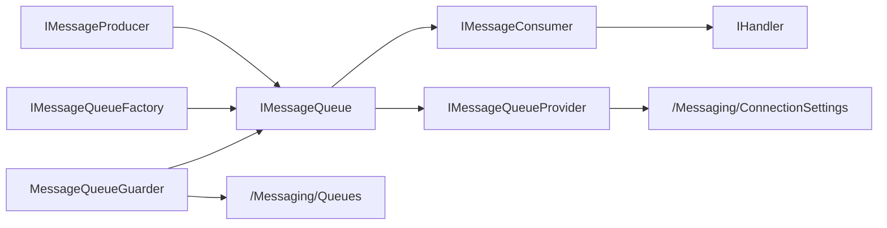

# Zongsoft.Messaging

`Zongsoft.Messaging` 是核心库中的消息队列抽象层。它不绑定 Kafka、RabbitMQ、MQTT 或 ZeroMQ 的某一种协议，而是把应用侧真正需要稳定依赖的概念抽出来：生产消息、订阅主题、处理消息、确认消费、根据配置创建队列，以及在宿主中守护一组订阅。

具体消息队列由 [消息队列插件](../messaging.md) 提供。业务模块应优先依赖核心抽象，只有在需要配置驱动专属参数、直接构造驱动队列或使用 ZeroMQ 附加通信能力时，才引用具体实现包。

## 设计定位

消息队列抽象的核心理念是“统一入口，保留语义边界”：

* 统一入口：发布方通过 `IMessageProducer` 发送字节或文本消息；订阅方通过 `IMessageQueue` 订阅主题并获得 `IMessageConsumer`。
* 统一消息：所有实现最终交给处理器的是 `Message`，包含主题、标签、消息体、标识符、发送者身份、时间戳和确认回调。
* 统一配置：插件把连接设置驱动注册到 `/Workbench/Configuration/ConnectionSettings/Drivers`，队列提供器再从 `/Messaging/ConnectionSettings` 读取连接项。
* 保留边界：`MessageReliability`、标签、延迟、过期、优先级等选项是框架意图，不代表每个底层产品都支持同样语义。核心层会检查可靠性上限、正数延迟和非空压缩设置；不支持时拒绝调用。其他选项的具体映射仍需核对驱动。



## 主要类型

| 类型 | 说明 |
| --- | --- |
| `Message` | 消息结构，承载主题、标签、数据、标识符、身份、时间戳和确认回调。 |
| `IMessageProducer` | 生产者接口，提供按默认主题、指定主题和指定标签发送字节或文本消息的方法。 |
| `IMessageQueue` | 队列接口，继承 `IMessageProducer`，增加队列名称、释放状态和订阅能力。 |
| `IMessageConsumer` | 消费者接口，表示一次订阅；继承 [通讯通道](communication/general.md) 的关闭模型，可取消订阅。 |
| `IMessageQueueFactory` | 队列工厂，根据连接设置或连接字符串创建队列实例。 |
| `IMessageQueueProvider` | 队列提供器，按名称从应用配置中发现并复用队列实例。 |
| `MessageQueueBase<TSubscriber>` | 队列基类，实现发送和订阅重载、默认主题解析、订阅集合和释放流程。 |
| `MessageConsumerBase<TQueue>` | 消费者基类，把订阅生命周期纳入 [Channel](communication/general.md) 关闭模型。 |
| `MessageQueueGuarder` | 宿主[工作器](https://github.com/Zongsoft/framework/blob/main/Zongsoft.Core/src/Components/IWorker.cs)，根据配置启动一组订阅，并在停止时取消订阅。 |

处理器使用 [`IHandler<T>`](components/handler.md) 承接消息处理逻辑。这样订阅回调可以是简单委托，也可以是可复用、可注入、可组合的处理器对象。

## Message 模型

`Message` 是一个轻量结构，重点不是描述所有中间件字段，而是提供跨实现都能表达的最小消息单元：

| 属性 | 说明 |
| --- | --- |
| `Topic` | 主题名。实现可能会对主题做转换，例如 RabbitMQ 把 `/` 转成 `.`，ZeroMQ 会把分组前缀拼到主题前。 |
| `Tags` | 标签文本。核心层支持传递标签，但具体实现是否用于过滤取决于驱动。 |
| `Data` | 消息体字节数组。文本发送重载会使用指定编码，默认使用 UTF-8。 |
| `Identifier` | 消息标识符，通常由底层实现返回或填充。 |
| `Identity` | 消息发送者或客户端身份，只有部分实现会设置。 |
| `Timestamp` | 消息时间戳；新建消息默认使用 UTC 时间，部分实现会使用底层消息时间。 |
| `IsEmpty` | 数据为空时为真；轮询器用它表示未取到有效消息。 |

`Message.Acknowledge()` 和 `Message.AcknowledgeAsync()` 调用消息内携带的确认回调。确认的具体效果由实现决定：Kafka 提交 offset，RabbitMQ 发送 `BasicAck`，MQTT 调用 MQTTnet 的确认方法，ZeroMQ 的 `LeastOnce` 通过 Control 通道确认，`MostOnce` 没有可靠确认。Kafka 当前配置未关闭客户端自动提交，显式 Commit 不保证未确认消息必然重投。


不要把“收到消息”和“消息已经被中间件确认”混为一谈。订阅处理器如果需要至少一次处理语义，应在业务处理成功后再调用 `AcknowledgeAsync()`；如果处理器从不确认，Kafka、RabbitMQ、MQTT 等实现可能按各自协议保留未确认状态或重新投递。


## 生产消息

生产接口提供字节和文本两组重载。调用方可以只传消息体，让队列从连接设置中的 `Topic` 取默认主题；也可以显式传入主题和标签。

Discussions 的站内信保存在数据库中，没有直接使用中间件队列。本节使用框架现有的能力边界测试；其中 TestQueue 是同一测试文件里的内存夹具，不会连接 Broker。发送消息的完整客户端见 [Kafka 项目](../messaging/projects/kafka.md)。

来源：[framework/Zongsoft.Core/test/Messaging/MessageQueueBaseTest.cs](https://github.com/Zongsoft/framework/blob/main/Zongsoft.Core/test/Messaging/MessageQueueBaseTest.cs#L59)（节选；上下文见源文件）。


```csharp
public async Task UnsupportedDelayFailsBeforeDriverOperation()
{
	using var queue = new TestQueue();
	var options = new MessageEnqueueOptions(TimeSpan.FromSeconds(1));

	var exception = await Assert.ThrowsAsync<OperationException>(() => queue.ProduceAsync("tests/delay", ReadOnlyMemory<byte>.Empty, options).AsTask());

	Assert.Equal(nameof(OperationException.Unsupported), exception.Reason);
	Assert.Contains(MessageQueueFeature.Delay.Name, exception.Message);
	Assert.Equal(0, queue.ProduceCount);
}
```


该测试请求一秒延迟，但队列没有声明 Delay 能力，因此在调用驱动前失败，ProduceCount 保持零。支持能力的队列才会收到相应选项。

`MessageEnqueueOptions` 表达发布意图：

| 选项 | 说明 |
| --- | --- |
| `Delay` | 延迟投递。正值要求队列声明 Delay 能力，否则在进入驱动前拒绝。 |
| `Expiration` | 消息有效期。RabbitMQ、MQTT 5、ZeroMQ 可靠通道等分别实现自己的过期语义。 |
| `Priority` | 优先级。RabbitMQ 会写入消息优先级。 |
| `Reliability` | 不得超过驱动声明的上限；MQTT 映射为 QoS，ZeroMQ 区分广播与可靠通道。 |
| Properties | 扩展属性。RabbitMQ 写入 headers，MQTT 5 写入 user properties。 |
| Compression | 算法与字节阈值；非空设置要求队列声明 Compression 能力。 |

## 订阅消息

`IMessageQueue.SubscribeAsync(...)` 支持三类订阅方式：

* 不指定主题：使用连接设置的默认 `Topic`；如果也没有默认主题，则由具体实现决定空主题含义。
* 指定主题：订阅一个明确主题或模式。
* 指定主题和标签：传入标签过滤意图，是否生效取决于实现。

来源：[framework/Zongsoft.Core/test/Messaging/MessageQueueBaseTest.cs](https://github.com/Zongsoft/framework/blob/main/Zongsoft.Core/test/Messaging/MessageQueueBaseTest.cs#L283)（节选；上下文见源文件）。


```csharp
public async Task ConflictingSubscriptionDoesNotReplaceExistingConsumer()
{
	using var queue = new TestQueue();
	var handler = new TestHandler();
	var first = await queue.SubscribeAsync("tests/conflict", "alpha,beta", handler, new MessageSubscribeOptions(MessageReliability.MostOnce));

	await Assert.ThrowsAsync<InvalidOperationException>(() => queue.SubscribeAsync("tests/conflict", "alpha,beta", new TestHandler(), new MessageSubscribeOptions(MessageReliability.MostOnce)).AsTask());
	await Assert.ThrowsAsync<InvalidOperationException>(() => queue.SubscribeAsync("tests/conflict", "alpha", handler, new MessageSubscribeOptions(MessageReliability.MostOnce)).AsTask());
	await Assert.ThrowsAsync<InvalidOperationException>(() => queue.SubscribeAsync("tests/conflict", "alpha,beta", handler, new MessageSubscribeOptions(MessageReliability.LeastOnce)).AsTask());

	Assert.Same(first, queue.Subscribers["tests/conflict"]);
	Assert.Equal(1, queue.CreateCount);
	Assert.Equal(1, queue.SubscribeCount);
}
```


上面的测试固定主题 tests/conflict，然后分别改变处理器、标签与可靠性；这些变化都会被视为不兼容订阅。实际异步处理器见[消息处理器示例](../messaging.md)。异步处理必须使用 `IHandler<Message>`，不要把异步 lambda 传给同步委托重载。

`IMessageConsumer` 是一次订阅的句柄。下面的测试释放首个消费者后重新订阅，确认旧项被移除，并产生新的订阅者：

来源：[framework/Zongsoft.Core/test/Messaging/MessageQueueBaseTest.cs](https://github.com/Zongsoft/framework/blob/main/Zongsoft.Core/test/Messaging/MessageQueueBaseTest.cs#L260)（节选；上下文见源文件）。


```csharp
public async Task ActiveConsumerCloseRemovesEntryAndAllowsResubscribe()
{
	using var queue = new TestQueue();
	var first = await queue.SubscribeAsync("tests/resubscribe", new TestHandler());

	Assert.NotNull(first);
	Assert.Single(queue.Subscribers);

	await first.DisposeAsync();

	Assert.Empty(queue.Subscribers);
	Assert.Equal(1, queue.UnsubscribedCount);

	var second = await queue.SubscribeAsync("tests/resubscribe", new TestHandler());

	Assert.NotNull(second);
	Assert.NotSame(first, second);
	Assert.Single(queue.Subscribers);
	Assert.Equal(2, queue.CreateCount);
	Assert.Equal(2, queue.SubscribeCount);
}
```


`MessageQueueBase<TSubscriber>` 以主题为键保存订阅者。只有同一主题的处理器、标签及规范化选项一致时才会复用初始化任务和订阅者；不兼容的重复订阅会抛出冲突异常。初始化失败的项不会作为活动消费者暴露。需要多个处理器时，应明确设计分发或使用独立订阅范围。

## 可靠性和失败退避

`MessageReliability` 有三个值：

| 值 | 含义 |
| --- | --- |
| `MostOnce` | 最多一次。倾向于减少重复，允许消息丢失。 |
| `LeastOnce` | 至少一次。倾向于不丢消息，但可能重复投递。 |
| `ExactlyOnce` | 精确一次。表达最强语义，但是否可达取决于底层产品、配置和业务幂等设计。 |

`MessageFallbackBehavior` 用于描述订阅回调失败后的退避策略，目前核心层只是把该意图保存在 `MessageSubscribeOptions` 中，具体实现尚未统一执行重试流程。编写处理器时仍应把幂等、异常记录、死信或补偿逻辑放在业务侧或底层中间件配置中。


“精确一次”不能只靠框架枚举保证。生产端事务、消费端确认、业务幂等键、去重存储和中间件能力都要同时成立，才能接近精确一次处理效果。


## 配置和发现

消息队列连接配置位于 `/Messaging/ConnectionSettings`。每个连接项通过 `driver` 选择具体实现，通过 `connectionSetting.name` 作为队列名称。

来源：[framework/messaging/kafka/src/Zongsoft.Messaging.Kafka.option](https://github.com/Zongsoft/framework/blob/main/messaging/kafka/src/Zongsoft.Messaging.Kafka.option#L3)（节选；上下文见源文件）。


```xml
<options>
	<option path="/Messaging">
		<connectionSettings>
			<connectionSetting connectionSetting.name="kafka" driver="kafka"
			                   value="server=127.0.0.1;username=program;password=xxxxxx;client=client1;group=group1" />
		</connectionSettings>
	</option>
</options>
```


上面的配置是 Kafka 插件附带的本地范例，xxxxxx 是占位密码，运行前应按测试 Broker 修改。`IMessageQueueProvider` 负责读取该路径。提供器按驱动名称匹配连接项，创建出的队列以弱引用缓存；当队列已释放或被回收后，下次访问会重新创建。

来源：[framework/Zongsoft.Core/src/Messaging/MessageQueueUtility.cs](https://github.com/Zongsoft/framework/blob/main/Zongsoft.Core/src/Messaging/MessageQueueUtility.cs#L40)（节选；上下文见源文件）。


```csharp
public static IMessageQueue Queue(IServiceProvider services, string name, IEnumerable<KeyValuePair<string, string>> settings = null)
{
	name ??= string.Empty;
	services ??= ApplicationContext.Current?.Services ?? throw new ArgumentNullException(nameof(services));

	foreach(var provider in services.ResolveAll<IMessageQueueProvider>())
	{
		if(provider.Exists(name))
			return provider.Queue(name, settings);
	}

	return null;
}
```


如果同名连接项可能被多个提供器识别，或希望在配置中明确指定驱动，可使用 `MessageQueueConverter` 支持的 `队列名@提供器名` 形式：

转换语法为“队列名@提供器名”。队列名必须来自真实连接项，提供器名来自驱动注册；可对照上面 Kafka.option 的 kafka 连接及 [MessageQueueConverter](https://github.com/Zongsoft/framework/blob/main/Zongsoft.Core/src/Messaging/MessageQueueConverter.cs) 核对。

## 守护订阅

`MessageQueueGuarder` 是一个 [工作器](components/worker.md)，适合在宿主启动时自动订阅一组主题。它有三个关键属性：

| 属性 | 说明 |
| --- | --- |
| `Queue` | 要守护的消息队列，可通过字符串转换器按队列名和提供器名解析。 |
| `Handler` | 消息处理器。 |
| `Options` | 队列订阅配置；为空时从 `Messaging/Queues` 读取。 |

订阅配置位于 `Messaging/Queues`，用于声明队列名称、订阅可靠性、失败退避和主题过滤器：

Discussions 当前没有守护订阅配置。可从 [QueueOptions](https://github.com/Zongsoft/framework/blob/main/Zongsoft.Core/src/Messaging/Options/QueueOptions.cs)、[QueueSubscriptionOptions](https://github.com/Zongsoft/framework/blob/main/Zongsoft.Core/src/Messaging/Options/QueueSubscriptionOptions.cs) 阅读实际配置模型；守护器按 Queue.Name 匹配集合中的项，再逐条订阅 Filters。只安装驱动不会自动产生业务处理器。

过滤器也可以通过启动参数补充，格式由 `QueueSubscriptionFilter.Parse(...)` 解析，支持 `Topic`、`Topic:TagA,TagB`、`Topic?TagA,TagB` 等写法。

## 实现扩展

新增一个消息队列实现通常包括四部分：

1. 连接设置类型：实现 `IMessageQueueSettings`，继承连接设置基类，并声明 `Server`、`Client`、`Group`、`Topic`、`Timeout` 等通用属性及驱动专属属性。
2. 队列类型：继承 `MessageQueueBase<TSubscriber, TSettings>`，实现 `OnProduceAsync(...)`、`CreateSubscriberAsync(...)` 和 `OnSubscribeAsync(...)`。
3. 消费者类型：继承 `MessageConsumerBase<TQueue>`，把底层消息转换成 `Message`，并在确认回调中执行底层 ACK、commit 或确认操作。
4. 工厂和提供器：实现或继承 `MessageQueueFactoryBase`、`MessageQueueProviderBase<TQueue, TSettings>`，并通过服务特性注册。


实现者应明确写出哪些 `MessageEnqueueOptions`、`MessageSubscribeOptions` 和标签语义被支持，哪些会被忽略。统一接口是为了降低业务依赖成本，不是为了掩盖底层消息系统的真实能力。


## 相关资源

* [事件通道](components/events.md)
* [消息队列插件](../messaging.md)
* [连接配置](../data/connections.md)
* [插件文件与加载](../plugins/plugin-file.md)
* [Messaging 源码目录](https://github.com/Zongsoft/framework/tree/main/Zongsoft.Core/src/Messaging)

## 消息存储与负载所有权

`IMessageStorage` 是独立于传输驱动的持久消息契约。存储保存消息元数据和负载快照，不持久化确认委托；恢复后的确认行为由 Broker 重新建立。配置及身份迁移见[可靠消息存储](../messaging/reliability.md)。

`Message.Data` 当前仍是字节数组。框架 `IsEmpty` 将空数组也视为空消息，但部分协议允许合法空业务负载；驱动适配不能简单把所有空载荷丢弃为无消息。延迟执行或持久化时应按实现契约快照借用数据，避免调用者修改数组影响已接受消息。
