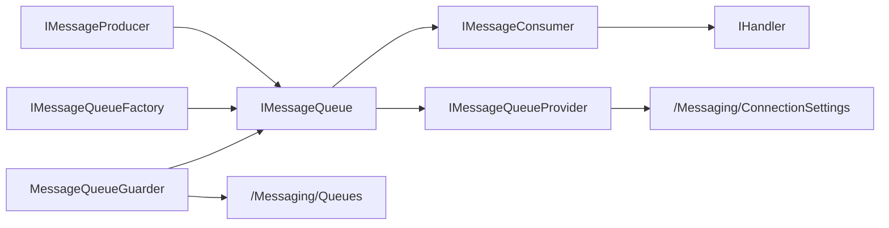

# Zongsoft.Messaging

`Zongsoft.Messaging` 是核心库中的消息队列抽象层。它不绑定 Kafka、RabbitMQ、MQTT 或 ZeroMQ 的某一种协议，而是把应用侧真正需要稳定依赖的概念抽出来：生产消息、订阅主题、处理消息、确认消费、根据配置创建队列，以及在宿主中守护一组订阅。

具体消息队列由 [消息队列插件](../messaging.md) 提供。业务模块应优先依赖核心抽象，只有在需要配置驱动专属参数、直接构造驱动队列或使用 ZeroMQ 附加通信能力时，才引用具体实现包。

## 设计定位

消息队列抽象的核心理念是“统一入口，保留语义边界”：

* 统一入口：发布方通过 `IMessageProducer` 发送字节或文本消息；订阅方通过 `IMessageQueue` 订阅主题并获得 `IMessageConsumer`。
* 统一消息：所有实现最终交给处理器的是 `Message`，包含主题、标签、消息体、标识符、发送者身份、时间戳和确认回调。
* 统一配置：插件把连接设置驱动注册到 `/Workbench/Configuration/ConnectionSettings/Drivers`，队列提供器再从 `/Messaging/ConnectionSettings` 读取连接项。
* 保留边界：`MessageReliability`、标签、延迟、过期、优先级等选项是框架意图，不代表每个底层产品都支持同样语义。实现不支持的能力通常会被忽略或降级。



## 主要类型

| 类型 | 说明 |
| --- | --- |
| `Message` | 消息结构，承载主题、标签、数据、标识符、身份、时间戳和确认回调。 |
| `IMessageProducer` | 生产者接口，提供按默认主题、指定主题和指定标签发送字节或文本消息的方法。 |
| `IMessageQueue` | 队列接口，继承 `IMessageProducer`，增加队列名称、释放状态和订阅能力。 |
| `IMessageConsumer` | 消费者接口，表示一次订阅；继承 [通讯通道](communication/general.md) 的关闭模型，可取消订阅。 |
| `IMessageQueueFactory` | 队列工厂，根据连接设置或连接字符串创建队列实例。 |
| `IMessageQueueProvider` | 队列提供器，按名称从应用配置中发现并复用队列实例。 |
| `MessageQueueBase<TSubscriber>` | 队列基类，实现发送和订阅重载、默认主题解析、订阅集合和释放流程。 |
| `MessageConsumerBase<TQueue>` | 消费者基类，把订阅生命周期纳入 [Channel](communication/general.md#channel-she-ji-si-xiang) 关闭模型。 |
| `MessageQueueGuarder` | 宿主工作器，根据配置启动一组订阅，并在停止时取消订阅。 |

处理器使用 [`IHandler<T>`](components/handler.md) 承接消息处理逻辑。这样订阅回调可以是简单委托，也可以是可复用、可注入、可组合的处理器对象。

## Message 模型

`Message` 是一个轻量结构，重点不是描述所有中间件字段，而是提供跨实现都能表达的最小消息单元：

| 属性 | 说明 |
| --- | --- |
| `Topic` | 主题名。实现可能会对主题做转换，例如 RabbitMQ 把 `/` 转成 `.`，ZeroMQ 会把分组前缀拼到主题前。 |
| `Tags` | 标签文本。核心层支持传递标签，但具体实现是否用于过滤取决于驱动。 |
| `Data` | 消息体字节数组。文本发送重载会使用指定编码，默认使用 UTF-8。 |
| `Identifier` | 消息标识符，通常由底层实现返回或填充。 |
| `Identity` | 消息发送者或客户端身份，只有部分实现会设置。 |
| `Timestamp` | 消息时间戳；新建消息默认使用 UTC 时间，部分实现会使用底层消息时间。 |
| `IsEmpty` | 数据为空时为真；轮询器用它表示未取到有效消息。 |

`Message.Acknowledge()` 和 `Message.AcknowledgeAsync()` 调用消息内携带的确认回调。确认的具体效果由实现决定：Kafka 提交 offset，RabbitMQ 发送 `BasicAck`，MQTT 调用 MQTTnet 的确认方法，ZeroMQ 当前消息没有确认回调。


不要把“收到消息”和“消息已经被中间件确认”混为一谈。订阅处理器如果需要至少一次处理语义，应在业务处理成功后再调用 `AcknowledgeAsync()`；如果处理器从不确认，Kafka、RabbitMQ、MQTT 等实现可能按各自协议保留未确认状态或重新投递。


## 生产消息

生产接口提供字节和文本两组重载。调用方可以只传消息体，让队列从连接设置中的 `Topic` 取默认主题；也可以显式传入主题和标签。


```csharp
using System.Text;
using Zongsoft.Messaging;

var queue = MessageQueueUtility.Queue("Orders");

await queue.ProduceAsync(
	"Orders.Created",
	Encoding.UTF8.GetBytes("""{"id":1001}"""),
	new MessageEnqueueOptions(MessageReliability.LeastOnce)
	{
		Expiration = TimeSpan.FromMinutes(5),
		Priority = 5,
	});
```


`MessageEnqueueOptions` 表达发布意图：

| 选项 | 说明 |
| --- | --- |
| `Delay` | 延迟投递。当前四个实现没有完整映射该选项。 |
| `Expiration` | 消息有效期。RabbitMQ 会映射到消息过期属性。 |
| `Priority` | 优先级。RabbitMQ 会写入消息优先级。 |
| `Reliability` | 发布可靠性意图。MQTT 会映射为 QoS；其它实现按自身配置处理。 |
| `Properties` | 扩展属性。RabbitMQ 写入 headers，MQTT 写入 user properties。 |

## 订阅消息

`IMessageQueue.SubscribeAsync(...)` 支持三类订阅方式：

* 不指定主题：使用连接设置的默认 `Topic`；如果也没有默认主题，则由具体实现决定空主题含义。
* 指定主题：订阅一个明确主题或模式。
* 指定主题和标签：传入标签过滤意图，是否生效取决于实现。


```csharp
using System.Text;
using Zongsoft.Messaging;

var queue = MessageQueueUtility.Queue("Orders");

var consumer = await queue.SubscribeAsync(
	"Orders.Created",
	async message =>
	{
		var text = Encoding.UTF8.GetString(message.Data);
		Console.WriteLine($"[{message.Topic}] {text}");

		await message.AcknowledgeAsync();
	},
	new MessageSubscribeOptions(
		MessageReliability.LeastOnce,
		MessageFallbackBehavior.Backoff));
```


`IMessageConsumer` 是一次订阅的句柄。保留它可以在应用运行中主动取消订阅：


```csharp
await consumer.UnsubscribeAsync();
```


`MessageQueueBase<TSubscriber>` 以主题为键保存订阅者。同一个队列实例对同一主题重复订阅时，会复用已有订阅者；如果需要多个独立处理器，应使用不同主题、不同队列实例，或在一个处理器内部进行分发。

## 可靠性和失败退避

`MessageReliability` 有三个值：

| 值 | 含义 |
| --- | --- |
| `MostOnce` | 最多一次。倾向于减少重复，允许消息丢失。 |
| `LeastOnce` | 至少一次。倾向于不丢消息，但可能重复投递。 |
| `ExactlyOnce` | 精确一次。表达最强语义，但是否可达取决于底层产品、配置和业务幂等设计。 |

`MessageFallbackBehavior` 用于描述订阅回调失败后的退避策略，目前核心层只是把该意图保存在 `MessageSubscribeOptions` 中，具体实现尚未统一执行重试流程。编写处理器时仍应把幂等、异常记录、死信或补偿逻辑放在业务侧或底层中间件配置中。


“精确一次”不能只靠框架枚举保证。生产端事务、消费端确认、业务幂等键、去重存储和中间件能力都要同时成立，才能接近精确一次处理效果。


## 配置和发现

消息队列连接配置位于 `/Messaging/ConnectionSettings`。每个连接项通过 `driver` 选择具体实现，通过 `connectionSetting.name` 作为队列名称。


```xml
<configuration>
	<option path="/Messaging">
		<connectionSettings>
			<connectionSetting connectionSetting.name="Orders"
			                   driver="Kafka"
			                   value="server=127.0.0.1:9092;client=orders-app;group=orders-workers;topic=Orders.Created" />
		</connectionSettings>
	</option>
</configuration>
```


`IMessageQueueProvider` 负责读取该路径。提供器按驱动名称匹配连接项，创建出的队列以弱引用缓存；当队列已释放或被回收后，下次访问会重新创建。


```csharp
using Zongsoft.Messaging;

var queue = MessageQueueUtility.Queue("Orders");

await queue.ProduceAsync("Orders.Created", """{"id":1001}""".AsMemory());
```


如果同名连接项可能被多个提供器识别，或希望在配置中明确指定驱动，可使用 `MessageQueueConverter` 支持的 `队列名@提供器名` 形式：


```text
Orders@Kafka
Telemetry@Mqtt
Default@RabbitMQ
Local@ZeroMQ
```


## 守护订阅

`MessageQueueGuarder` 是一个 [工作器](components/worker.md)，适合在宿主启动时自动订阅一组主题。它有三个关键属性：

| 属性 | 说明 |
| --- | --- |
| `Queue` | 要守护的消息队列，可通过字符串转换器从 `Orders@Kafka` 解析。 |
| `Handler` | 消息处理器。 |
| `Options` | 队列订阅配置；为空时从 `Messaging/Queues` 读取。 |

订阅配置位于 `Messaging/Queues`，用于声明队列名称、订阅可靠性、失败退避和主题过滤器：


```xml
<configuration>
	<option path="/Messaging">
		<queues>
			<queue name="Orders">
				<subscription reliability="LeastOnce" fallback="Backoff">
					<filter topic="Orders.Created" />
					<filter topic="Orders.Paid" />
				</subscription>
			</queue>
		</queues>
	</option>
</configuration>
```


过滤器也可以通过启动参数补充，格式由 `QueueSubscriptionFilter.Parse(...)` 解析，支持 `Topic`、`Topic:TagA,TagB`、`Topic?TagA,TagB` 等写法。

## 实现扩展

新增一个消息队列实现通常包括四部分：

1. 连接设置类型：实现 `IMessageQueueSettings`，继承连接设置基类，并声明 `Server`、`Client`、`Group`、`Topic`、`Timeout` 等通用属性及驱动专属属性。
2. 队列类型：继承 `MessageQueueBase<TSubscriber, TSettings>`，实现 `OnProduceAsync(...)`、`CreateSubscriberAsync(...)` 和 `OnSubscribeAsync(...)`。
3. 消费者类型：继承 `MessageConsumerBase<TQueue>`，把底层消息转换成 `Message`，并在确认回调中执行底层 ACK、commit 或确认操作。
4. 工厂和提供器：实现或继承 `MessageQueueFactoryBase`、`MessageQueueProviderBase<TQueue, TSettings>`，并通过服务特性注册。


实现者应明确写出哪些 `MessageEnqueueOptions`、`MessageSubscribeOptions` 和标签语义被支持，哪些会被忽略。统一接口是为了降低业务依赖成本，不是为了掩盖底层消息系统的真实能力。


## 相关资源

* [事件通道](components/events.md)
* [消息队列插件](../messaging.md)
* [连接配置](../data/connections.md)
* [插件文件与加载](../plugins/plugin-file.md)
* [Messaging 源码目录](https://github.com/Zongsoft/framework/tree/main/Zongsoft.Core/src/Messaging)
