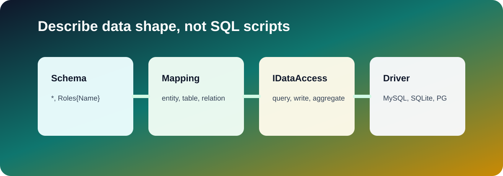

# Data Engine

[English](README.md) | [简体中文](README.zh-Hans.md)

`Zongsoft.Data` is a GraphQL-like ORM and data-access framework. It uses data schemas, mapping files, condition expressions, and database drivers to describe access structures, enabling complex queries, navigation, filtering, paging, grouping, aggregation, and mutations without hand-writing SQL for each operation.

The engine separates data access into four stable layers:

- Model layer: application code uses POCO or anonymous objects.
- Metadata layer: `.mapping` files describe entities, fields, inheritance, and relationships.
- Access layer: `IDataAccess` exposes consistent query, mutation, aggregation, import, and command APIs.
- Driver layer: database drivers translate the common expression model into provider-specific SQL and execute it.

## Capabilities

- Strict POCO support.
- Read/write separation.
- Table-inheritance operations.
- Mapping isolation by application module.
- Data schemas that describe query and mutation shapes.
- Multiple database drivers.

## Core Topics

- [Data schemas](schema.md): describe the shape of data to read or write.
- [Mapping files](mapping.md): map entities, tables, fields, and relationships.
- [Connections](connections.md): configure data sources, read/write separation, and drivers.
- [Data access](data-access.md): execute queries, mutations, aggregation, and commands.
- [Conditions and operands](conditions-and-operands.md): express filters and field operations.
- [Querying and navigation](querying.md): read object graphs with schemas, paging, and sorting.
- [Writing](writing.md): insert, update, delete, and upsert data.
- [Drivers](drivers.md): select, deploy, and extend database providers.

## Choosing a Starting Point

- To configure a database, start with [Connections](connections.md) and [Drivers](drivers.md).
- To define an entity, start with [Mapping files](mapping.md).
- To query an object graph, read [Data schemas](schema.md) and [Querying](querying.md).
- To mutate data, read [Writing](writing.md) and [Conditions and operands](conditions-and-operands.md).

The source repository and the [Zongsoft.Data README](https://github.com/Zongsoft/framework/blob/main/Zongsoft.Data/README.md) remain the authoritative references for current package behavior.
