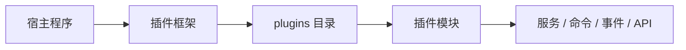

# 插件框架

`Zongsoft.Plugins` 是 Zongsoft 插件化应用的核心库。它让终端程序、富客户端、后台服务和 Web 应用都可以被改造成插件式应用。

## 核心概念

- 插件描述：使用 `*.plugin` 描述插件结构、扩展点和加载关系。
- 应用上下文：运行时中表示应用、环境、模块、服务和事件的上下文。
- 模块：插件加载后形成的应用模块。
- 服务注册：插件可以向应用注册服务、命令、事件处理器等能力。
- 宿主集成：宿主程序调用插件框架启动应用并加载插件目录。

## 与宿主程序的关系

宿主程序不是业务模块。它通过插件框架加载 `plugins/` 目录下的插件文件，再由插件提供业务能力。

## 继续阅读

- [插件应用模型](application-model.md)
- [插件文件与加载](plugin-file.md)
- [宿主程序](../../hosting/README.md)
