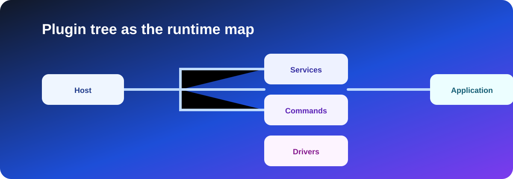

# Plugin Framework

[English](README.md) | [简体中文](README.zh-Hans.md)

The Zongsoft plugin framework assembles an application from plugin manifests, assemblies, built-ins, services, and extension nodes. It allows business capabilities to be packaged and deployed independently while the host remains a small, reusable startup environment.

## Main Concepts

- [Application model](application-model.md): the relationship between applications, modules, hosts, and plugins.
- [Plugin files and loading](plugin-file.md): manifests, dependencies, assemblies, and extension nodes.
- [Host integration](hosting.md): how terminal, daemon, and Web hosts load plugins.
- [Built-ins and services](builtins-and-services.md): constructing objects, exposing values, and registering services.

## Typical Workflow

1. Define the runtime dependency and assembly list in a `*.plugin` manifest.
2. Register or expose application components under the appropriate extension path.
3. Package related `*.option`, `*.mapping`, and other artifacts with the plugin.
4. Use a Zongsoft host to load the deployed plugin tree.
5. Diagnose failures by checking dependency order, assembly resolution, extension paths, and service registration.

Plugin manifests are runtime contracts. Keep plugin names, dependency names, type names, extension paths, project references, and deployment files synchronized.

See the [Zongsoft.Plugins README](https://github.com/Zongsoft/framework/blob/main/Zongsoft.Plugins/README.md) for the current package overview and source-level examples.
