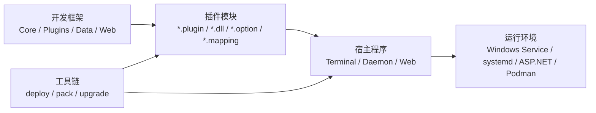

# 架构总览

Zongsoft 的整体架构可以按四层理解：基础框架、插件模块、宿主程序和工具链。

## 基础框架

基础框架提供跨模块共享的抽象与实现，包括集合、转换、组件模型、配置、缓存、服务、命令、终端、事务、安全、诊断等能力。

## 插件模块

插件模块是业务能力的主要承载单元。一个插件通常包含：

- `*.plugin` 插件描述文件。
- `*.dll` 程序集。
- `*.option` 选项配置文件。
- `*.mapping` 数据映射文件。
- 本地化资源、证书或其它附属文件。

## 宿主程序

宿主程序负责启动应用、加载插件和建立运行环境。当前宿主仓库包含三类宿主：

- 终端宿主：适合命令行交互、调试和复现。
- 后台服务宿主：适合以 Windows Service 或 systemd 服务运行。
- Web 宿主：适合 ASP.NET Web API、认证授权、接口调试和站点部署。

## 工具链

工具链负责把插件和宿主连接起来：

- `dotnet-deploy` 根据 `.deploy` 文件部署插件和附属文件。
- `dotnet-pack` 将发布目录制作成 `.tar.gz`、`.deb` 或 `.rpm` 安装包。
- `dotnet-upgrade` 制作、校验和发布自动升级包。
