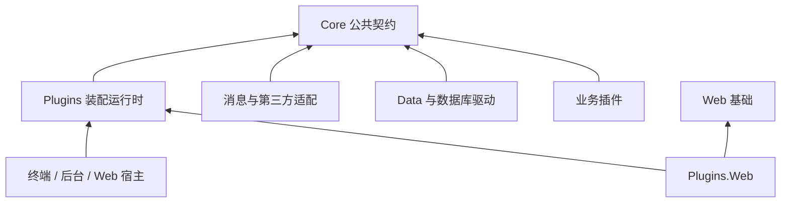
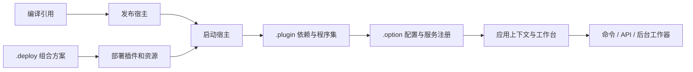

# 架构总览

理解 Zongsoft，可以先沿着一个业务请求观察：Web 宿主接收请求，业务插件处理用例，通过公共接口取得数据访问器、缓存或消息队列，具体插件再访问数据库和外部系统。宿主提供运行环境，业务表达意图，实现插件负责技术细节。

## 依赖方向

图中箭头表示主要依赖方向，省略了部分项目引用。它与调用顺序不同：业务代码运行时可以调用 Redis 提供的缓存，而编译时只引用 Core 的缓存契约。实现由[部署](deployment.md)和[服务解析](../framework/core/services.md)连接起来。

### Core：稳定的共同语言

[核心类库](../framework/core.md)包含应用与模块、服务、数据访问、消息、文件系统、安全、配置等公共契约，也包含集合和转换等通用实现。业务依赖哪个接口，应由需要表达的能力决定，而不是由准备采用的数据库或 SDK 决定。

这不意味着所有能力都有完全相同的语义。例如多个消息插件实现同一接口，但消息确认、持久化和顺序性仍有差别，详见[消息基础概念](../framework/messaging/concepts.md)。

### Plugins：把声明变成运行对象

[插件框架](../framework/plugins/README.md)读取插件清单，解析依赖，组织[插件树](concepts.md#plugin-tree)，加载声明的程序集并注册服务。插件树上的构件可由构建器创建，也可以暴露已有实例。

文件目录组织部署文件和插件父子关系；`/Workbench/Modules` 等扩展路径组织运行时对象。两种层次分别服务于文件部署和对象装配，不能根据目录名推断服务容器归属。

### 功能库与适配器：实现可替换的能力

[数据引擎](../framework/data/README.md)负责映射、查询表达式和执行管线，数据库驱动负责方言与数据库客户端。[Web](../framework/web.md)、[安全](../framework/security.md)、[诊断](../framework/diagnostics.md)等库提供面向特定领域的实现。[外部扩展](../framework/externals.md)负责接入第三方基础设施。

可替换的前提是双方满足同一业务语义。换掉驱动名称后，仍需验证数据类型、查询功能、事务与部署依赖；换掉脚本引擎后也需要验证脚本语言。

## 从文件到应用

1. **编译**确认代码能调用目标 API；框架源码中的 Debug 引用还可能依赖本机 Core 输出。
2. **部署**复制清单、程序集、选项、映射和附属资源，构成一个完整的运行目录。
3. **启动**建立内容根、配置与容器，加载插件并初始化应用。
4. **调用**才会触发部分延迟创建的服务、驱动或外部连接。


💡 插件出现在列表中，只证明它已被发现或加载。验证一个功能还需要检查服务解析、有效配置和首次业务调用。


## 生命周期由谁管理

应用上下文连接宿主的启动和停止，工作台承载需要运行的组件。普通服务和可启动工作器承担不同职责：服务提供操作；工作器负责持续运行、取消和收尾。构造函数应尽量只建立对象状态，避免把不可控的外部工作放进装配阶段。

模块服务容器提供名称域和回退规则，不是每个 HTTP 请求的作用域。共享服务不能保存某个请求独占的可变状态，调用方也不应随意释放从容器取得的共享实例。详见[模块、服务与提供者](concepts.md#module-service-provider)。

## 选择阅读路径

- 新建应用：从[准备环境](../get-started/prerequisites.md)到[部署第一个插件](../get-started/deploy-first-plugin.md)。
- 开发可组合业务：先看[基础概念](concepts.md)，再看[插件应用模型](../framework/plugins/application-model.md)。
- 接入数据库：先理解[对象关系与数据访问](../framework/data/concepts.md)，再完成映射、连接和查询。
- 运维交付：从[部署模型](deployment.md)进入[宿主部署](../hosting/deployment.md)与[工具](../tools/tools.md)。

源码入口：[Core](https://github.com/Zongsoft/framework/tree/main/Zongsoft.Core/src)、[应用构建器](https://github.com/Zongsoft/framework/blob/main/Zongsoft.Plugins/src/Hosting/ApplicationBuilder.cs)、[Web 插件入口](https://github.com/Zongsoft/framework/blob/main/Zongsoft.Plugins.Web/src/Application.cs)。
