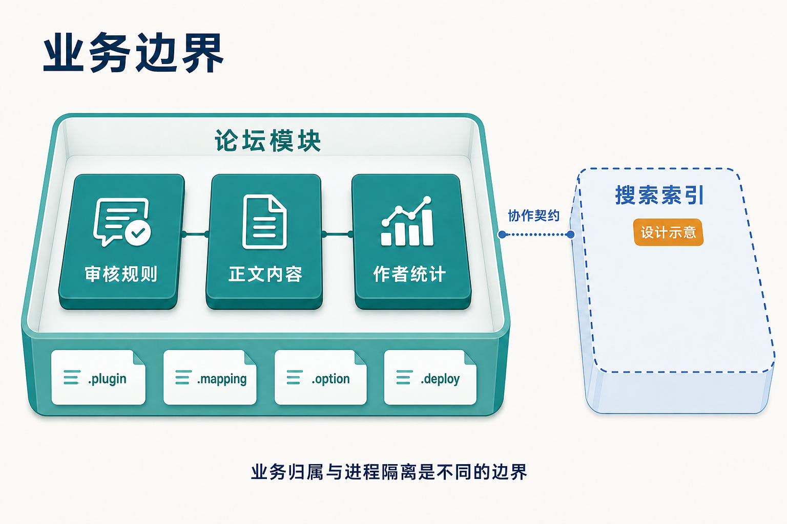

# 从业务变化确定模块边界

论坛要做“主题审核”：一次需求改动往往要同时调整主题状态、正文可见性、作者统计和相关查询。如果这些代码已经按“模型库”“服务库”“控制器库”分放，改动仍然要跨好几个目录甚至好几个团队，那么文件分类并没有替业务找到一个清晰的负责人。

模块边界应当由业务变化决定，而不是由代码职能或目录位置决定。Zongsoft 的插件化提供了应用模块、程序集、插件清单和部署文件四层组织手段，但每层只回答一个问题。先弄清楚“哪次变化、哪些规则、一起验收”，再决定用什么手段承载它。

_审核、正文与统计规则按业务归属组织，清单、映射、选项与部署文件等元数据随模块一起交付；搜索索引是需要另行约定的候选扩展。图示表达业务归属，不代表数据库或进程隔离。_

## 先跟着一次变化走

“批准主题”不是把某个布尔字段写成真。[ThreadService.Approve](https://github.com/Zongsoft/discussions/blob/main/src/Services/ThreadService.cs) 把主题编号、未审核状态和版主资格一起组成更新条件，同时更新主题对应正文的批准状态。审核规则、数据条件和权限判断写在同一个服务里，控制器只负责把结果映射成 HTTP 响应。

这说明边界可以从真实的业务动作里读出来：

- 哪些数据总是**一起变化**（主题与它的正文、统计字段）；
- 哪些规则必须由**同一处解释**（版主资格、可见性、审核状态）；
- 哪些失败必须**一起处理**（写正文失败时主题不能半提交）；
- 哪些能力要**一起发布、一起验收**（部署到宿主后一次调用就能走通）。

反过来，只看名字分组是靠不住的。两个类型都含“用户”，未必属于同一业务：登录身份、论坛作者统计和客户档案是三种不同的归属。边界是“变化与责任的边界”，不是“名字的边界”。

## 四层组织手段各回答一个问题

| 手段 | 回答的问题 | 论坛中的落点 |
| --- | --- | --- |
| 应用模块 | 这套能力以什么业务身份存在，模块服务如何解析、事件归谁 | [Module](https://github.com/Zongsoft/discussions/blob/main/src/Module.cs) 定义 Discussions 模块及其访问器 |
| 程序集 | 哪些类型一起编译，允许引用哪些依赖 | 领域库与 [Discussions.Web](https://github.com/Zongsoft/discussions/tree/main/src/api) 分开编译 |
| 插件清单 | 运行时加载哪些程序集，把对象挂到哪些扩展点 | 领域清单声明模块与过滤器；Web 清单声明领域依赖并交付控制器程序集 |
| 部署方案 | 交付哪些版本、配置、映射和资源 | 领域与 Web 分别用 `.deploy` 描述产物布局 |

应用模块和插件**不是一一对应**。模块是业务身份，插件是装配单位：论坛的领域清单把模块实例挂到 `/Workbench/Modules`，Web 清单依赖领域插件并把控制器随程序集交付。拆出一个 Web 程序集是为了约束协议依赖，不必因此再造一个“Web 业务模块”。名词关系见[基础概念](../concepts.md#module-service-provider)与[插件应用模型](../../framework/plugins/application-model.md)。


💡 边界四层可以独立变化：可以先拆程序集、暂不拆部署；也可以先由两个插件共同装配一个模块。每层是否引入，取决于当时是否出现对应的维护或交付问题。


## 完整性：规则连同交付资源一起负责

一个业务模块要能独立工作，责任范围应覆盖实现规则所需的模型、服务、映射、选项和资源。新增一个字段如果只改 C# 类型，却漏掉[映射文件](https://github.com/Zongsoft/discussions/blob/main/src/Zongsoft.Discussions.mapping)与数据库脚本，编译成功的模块仍然无法运行。

完整性不等于把所有文件放进同一个程序集。论坛的[领域部署文件](https://github.com/Zongsoft/discussions/blob/main/src/Zongsoft.Discussions.deploy)交付清单、选项、映射与程序集；[Web 部署文件](https://github.com/Zongsoft/discussions/blob/main/src/api/Zongsoft.Discussions.Web.deploy)额外交付 Web 清单与表格模板。两份产物必须一起进运行目录，Discussions 模块才可用。因此“分文件发布”不等于“彼此无需兼容”，维护者必须知道两份产物如何组成一个可用功能。

边界内部仍可分层：业务服务负责规则，控制器负责 HTTP 适配，数据过滤负责结果加工。职责清楚后，一次审核规则调整才能主要落在服务及其验证上，而不是散落在每个控制器里。跨入口复用的问题见[让业务能力跨宿主复用](host-independent-business.md)。

## 用“待拆分”检验候选边界

假设产品希望新增外部搜索索引。它有独立的查询技术和重建流程，表面上是独立插件的候选；但拆分之前要先回答：索引延迟是否可以接受、主题隐藏后多久不可被搜到、删除如何传播、索引故障时如何恢复。

如果产品要求内容隐藏立即生效，那么搜索结果就不能只依赖旧索引。要么返回结果前回查业务状态，要么设计满足时效的更新机制。此时可见性规则仍然归论坛，索引插件只承担搜索实现——“拆开了”不会自动替双方完成这个约定。

反过来，如果想把“批准主题”和“批准主题正文”拆成两个插件，却给不出各自独立的使用场景、失败处理和发布节奏，那么新增的协作成本通常大于收益。可以先保留类型内的分工，等真正需要独立组合时再建立装配边界。


🚨 模块服务容器提供的是名称解析域，不是安全边界。同进程内的代码仍可引用其他模块的实现或访问其数据库；需要租户隔离、数据权限或进程隔离时，要另行设计，详见[设计理念](../conception.md)。


## 工程约束补足模块边界

模块容器有助于组织服务查找，但它不能强制团队“只通过公共契约协作”。如果确实需要多个模块独立演进，应同时落实项目引用审查、接口评审和契约测试。核心类库适合承载通用契约；产品特有的跨模块契约应由产品团队明确归属，避免把所有共享类型堆进一个无限增长的公共库。


模块划分可以随理解加深而调整。规则少、改动集中、维护周期短的应用，保持简单结构更合适；出现反复共同变化、多人协作或独立交付需求时，再引入相应边界。评审候选模块时，试着说明它维护的业务规则、允许外部使用的入口、缺少依赖时的行为，以及替换它需要共同验证哪些产物。


## 延伸阅读

- 从业务动作出发，进一步讨论[如何让业务能力跨宿主复用](host-independent-business.md)。
- Elux 的[微模块设计](https://github.com/hiisea/elux/blob/main/docs/designed/micro-module.md)与作者对[前端业务模块化](https://www.cnblogs.com/hiisea/p/16624472.html)的探索，从按业务组织代码与资源的角度与本篇呼应；本篇按 Zongsoft 服务端的模块、装配与交付机制展开，两种框架的运行方式应分别理解。
- 模块、服务与提供者的名词边界见[基础概念](../concepts.md#module-service-provider)。
- 应用模块与插件装配的实现见[插件应用模型](../../framework/plugins/application-model.md)。
