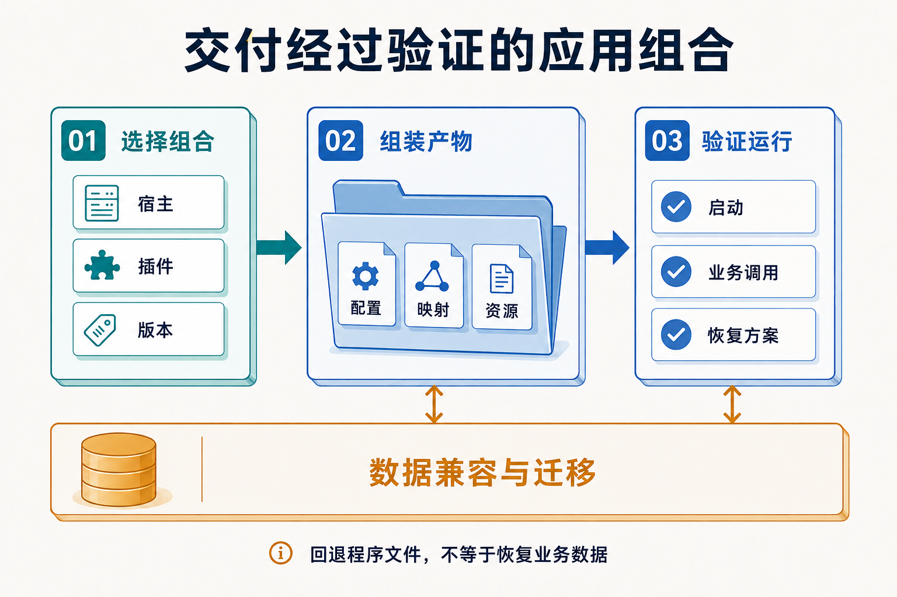

# 从局部改造到可验证的插件交付

一个正在使用的业务系统，很难暂停所有需求来重新设计。引入 Zongsoft 插件化时，可以先选一条责任清楚的业务路径，验证服务、装配和部署，再逐步扩大范围。每一步都应留下可以运行、可以观察、发生故障时知道如何处置的版本。

本篇给出渐进改造的设计方法。它适用于已有系统希望获得更明确的模块维护责任或产品组合能力的场景；论坛的文件组织用作实现参照，下面的迁移步骤不代表论坛正在进行这项改造。

## 选择一个能独立验收的切口

首个切口最好有明确的输入输出，调用链可以追踪，数据所有权和依赖也相对清楚。导出、内容查询或一个已稳定的业务动作都可能成为候选，具体应结合系统选择。横跨多个子系统的核心写入流程通常需要更多一致性设计，不宜仅因代码最复杂就把它作为首个试验。

以论坛的用户导出为参照，现有[模板模型提供者](https://github.com/Zongsoft/discussions/blob/main/src/Features/Archiving/UserDataTemplateModelProvider.cs)通过用户服务取得数据。若要改造类似能力，可以先保留调用入口和业务规则，把模板适配及资源交付组织为插件，再验证结果、筛选范围和权限。不能因为导出“只读”就绕过数据范围约束。

改造前先固定可观察的行为：相同输入返回什么、哪些身份允许调用、异常如何表现、资源消耗大致如何。后续每一步都与这个基线比较，才能知道结构改变是否连带改变了业务。

## 让每一步都有可运行的结果

| 阶段 | 主要改变 | 继续推进的依据 |
| --- | --- | --- |
| 提取业务入口 | 原入口改为调用职责明确的服务 | 原有结果、权限和失败行为仍可验证 |
| 声明插件装配 | 补齐清单、依赖和必要扩展 | 在目标宿主中能够加载并解析服务 |
| 固定交付文件 | 编写部署规则，收集配置与资源 | 在干净运行目录中完成一次真实调用 |
| 切换调用路径 | 新实现接管明确范围的调用 | 能观察错误、时延和新旧结果差异 |
| 收回旧实现 | 清理重复入口和不再需要的依赖 | 调用者已迁移，运行记录证明旧路径不再使用 |

这里的“切换”是一项发布安排，可以通过应用路由、配置或发布批次实现，并不意味着框架自动支持在线替换已加载的程序集。采用何种方式，应由目标宿主和交付方案决定。

若需要并行比较新旧实现，优先从无副作用且允许比较的数据读取开始。写操作不能直接各执行一遍来比对结果；重复发送通知、重复扣减或重复创建文件，可能造成无法靠回滚程序集恢复的业务影响。

## 把发布组合当成需要验证的对象

_宿主与插件版本确定以后，还需交付配置、映射和资源，并验证启动、业务调用及恢复方案。数据兼容与迁移需要单独设计，不能由文件回退替代。_

论坛的[领域部署文件](https://github.com/Zongsoft/discussions/blob/main/src/Zongsoft.Discussions.deploy)包含清单、选项、映射和程序集规则；[Web 部署文件](https://github.com/Zongsoft/discussions/blob/main/src/api/Zongsoft.Discussions.Web.deploy)另外包含 Web 清单与模板。这说明可用的交付单元需要覆盖运行所依赖的元数据和资源。

对于有多个客户方案的产品，建议记录每种受支持组合所使用的宿主、插件版本、数据驱动、配置要求和迁移步骤。发布验证至少要覆盖实际支持的最小组合与关键扩展组合，并检查遗漏可选插件和遗漏必需插件时的不同结果。无需把理论上所有插件排列组合都宣称为产品能力。

独立发布一个插件包，意味着可以单独产出和管理它；该版本是否能投入使用，还取决于宿主、共享依赖、扩展契约和数据结构是否兼容。尤其在同一进程中，共享程序集版本的冲突不能靠给插件目录改名解决。

## 数据变化决定恢复边界

插件版本回退只覆盖程序文件时，数据库与正文文件可能已经改变。比如新增映射字段以后，旧版本是否能忽略它；转换正文存储格式以后，旧版本是否仍能读取；新版本是否已经发出不可撤回的外部通知，都需要在发布前回答。

可按需求采用先增加兼容字段、逐步迁移数据、切换读写、最后移除旧结构的过程。对于无法兼容旧版本的数据变化，应明确恢复方案和维护窗口。部署工具负责交付产物，不能替应用推导数据迁移与业务补偿。工具分工见[部署模型](../deployment.md)和[升级流程](../../framework/upgrading/workflow.md)。

## 何时值得进一步拆成独立进程

插件化有助于组织代码和运行时装配，进程拆分则增加新的故障与通信边界。二者可以按实际需要组合。

| 出现的需求 | 首先评估的方案 | 额外成本或限制 |
| --- | --- | --- |
| 多产品选用不同能力 | 插件与部署方案组合 | 需要管理受支持的版本组合 |
| 多种入口共享业务规则 | 分离业务服务与宿主适配 | 仍需接续身份、配置及运行依赖 |
| 某项任务需要单独扩容或故障隔离 | 将相关能力放入独立宿主进程 | 需要协议、超时、观测及故障恢复 |
| 不可信扩展需要权限隔离 | 在部署与运行环境建立安全边界 | 同进程插件不能提供这类安全保证 |

把本地服务调用迁到网络后，失败不再只有成功或异常两种直观结果：请求超时的时候，远端可能已经完成写入。需要重新约定幂等、重试、数据所有权和结果查询，而不是只把接口实现换成远程客户端。进程拆分也不应成为每个插件必须经历的终点。

## 用一次发布检验设计效果

完成首个切口后，检查下一次需求能否主要在自己的业务范围内完成，运行目录能否重复组装，故障能否定位到服务调用或装配阶段，以及交付负责人是否能说明恢复步骤。这些结果比新增了多少项目更能反映改造是否有效。

继续实践可从[首个业务插件](../../get-started/first-business-plugin.md)、[部署第一个插件](../../get-started/deploy-first-plugin.md)与[运行调试](../../get-started/run-and-debug.md)开始；边界尚不清楚时，返回[业务边界](business-boundaries.md)重新检查变化与规则的归属。

## 延伸阅读

Elux 作者的[拆解大型前端应用](https://www.cnblogs.com/hiisea/p/16914890.html)及[微模块设计](https://github.com/hiisea/elux/blob/main/docs/designed/micro-module.md)提供了讨论模块化演进的起点。本篇的发布组合、数据库兼容与宿主进程取舍围绕 Zongsoft 服务端应用展开，并未把前端模块加载方式套用为插件升级保证。
