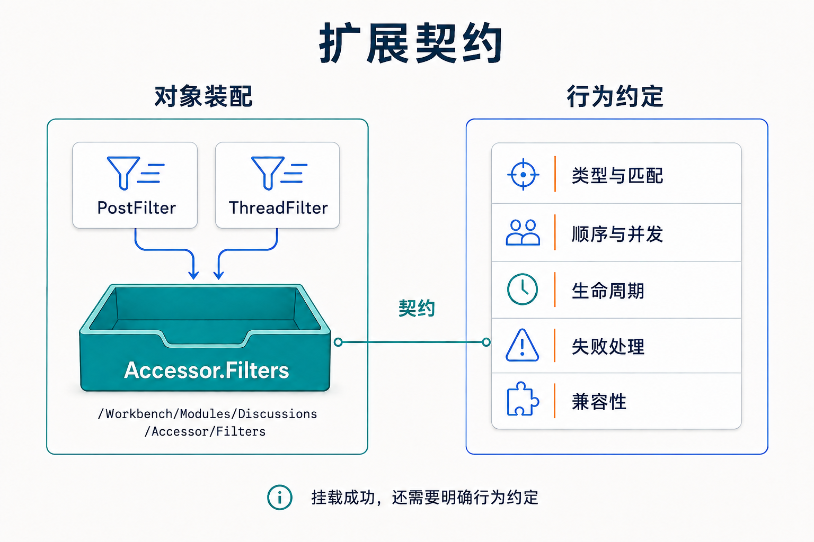

# 把扩展点设计成协作契约

一个插件能够被加载，只说明它进入了运行环境。要让另一个团队或插件为它增加能力，还需要说清楚：对象挂在哪里、遵守什么接口、何时被调用、失败后由谁负责。扩展点若想长期可用，就不能只提供一个“能加东西的列表”，而要成为双方都能独立工作的**契约**。

Zongsoft 的插件树把装配位置显式化，服务容器提供能力查找，数据引擎、Web 和安全模块再各自定义扩展点的业务语义。本篇以论坛过滤器为例，说明设计者需要为这些机制补齐哪些约定。机制语法见[插件文件与加载](../../framework/plugins/plugin-file.md)与[构件与服务](../../framework/plugins/builtins-and-services.md)。

## 从一个现有扩展点读出两方责任

论坛的 [Zongsoft.Discussions.plugin](https://github.com/Zongsoft/discussions/blob/main/src/Zongsoft.Discussions.plugin)在 `/Workbench/Modules` 下引用已有模块实例，并把模块访问器的过滤器集合暴露为可挂载节点；随后把 `PostFilter`、`ThreadFilter` 两个过滤器挂到 `/Workbench/Modules/Discussions/Accessor/Filters`。

这段装配关系包含两种责任：

- 模块一侧提供**可被扩展的集合**：`expose` 把访问器的 `Filters` 集合接入插件树，作为稳定的挂载目标。
- 过滤器一侧提供**符合要求的对象**：`object` 的 `type` 描述需要构建的构件类型，构件名是树节点名。

路径只是契约的一部分。现有过滤器还按模型匹配：`PostFilter` 只处理帖子，`ThreadFilter` 处理主题及正文。挂载成功不意味着所有查询都会执行某个过滤器。外部插件若继续向这个集合贡献对象，必须理解匹配条件、处理阶段和对象生命周期，不能只复制路径字符串。

_左侧是过滤器在插件树中的装配位置，右侧是扩展作者需要写清楚的行为约定；挂载成功不等于这些约定自动成立。_

## 按“完成条件”选择协作方式

模块之间协作不只有一种机制。先问“这次协作必须达到什么完成条件”，再选方式：

| 协作需要 | 可以采用的方式 | 需要写清楚的约定 |
| --- | --- | --- |
| 调用方必须取得本次操作结果 | 通过明确契约调用服务 | 输入、结果、权限、超时及失败语义 |
| 能力拥有者允许别人加入处理步骤 | 向扩展点贡献过滤器、处理器或驱动 | 适用范围、顺序、共享状态和异常处理 |
| 一个事实发生后通知多个关注方 | 定义事件及处理方式 | 触发时机、载荷、订阅者失败的影响 |
| 工作需要跨进程或在故障后继续投递 | 采用消息机制并安排持久化策略 | 确认、重试、重复处理及恢复责任 |

这些方式可以组合。例如业务操作通过服务完成，提交后再安排外部索引更新。但一个必须成功才能确认交易的步骤，不应仅因为希望“解耦”就改成没有完成约定的通知。事件减少了对具体订阅者的引用，也会把一部分依赖转移到事件语义和运行诊断上。


💡 论坛当前 [Module](https://github.com/Zongsoft/discussions/blob/main/src/Module.cs) 的 `Events` 只是暴露事件注册表，并不表示发帖或审核已经发布具体业务事件，更不表示已可靠投递到消息队列。新增这类能力仍需要完整实现，见[事件](../../framework/core/components/events.md)。


## 为扩展点写一份使用说明

假设产品准备允许第三方为“审核完成”增加处理器。评审时至少需要形成下列说明。这是扩展设计建议，不是论坛当前已有的扩展 API：

- **所有者与入口**：由谁维护扩展点；贡献插件需要依赖哪个插件；目标集合接收什么契约。
- **输入与适用范围**：提供已提交的业务标识还是可变对象；如何标识站点；哪些动作会触发处理。
- **顺序与并发**：多个处理器是否有先后关系，是否并发执行，能否重复调用。文件排列顺序不是业务顺序保证。
- **失败与生命周期**：异常是否影响主操作；谁记录和重试；停机时是否等待在途任务。
- **兼容与验证**：如何处理新增字段；旧插件能否继续工作；没有贡献处理器时业务是否仍可用。

扩展点公开的可变对象越多，外部插件越容易依赖内部细节。需要长期兼容的扩展，宜提供与动作目的相称的输入输出，避免把整个服务容器、数据访问器和内部对象图都变成公共协议。

## 插件依赖与项目引用一起审查

论坛的 [Web 清单](https://github.com/Zongsoft/discussions/blob/main/src/api/Zongsoft.Discussions.Web.plugin)依赖领域插件。程序集引用负责让类型可编译，清单依赖负责运行时装配顺序，部署方案负责把文件带到目标环境。三者都应和真实调用关系一致；清单中声明名称不会自动下载 NuGet 包。

如果两个业务插件需要互相引用内部服务，并在启动时等待对方构建对象，先检查协作职责能否重新归属：提取稳定公共契约，或让一个负责完整流程的上层组件协调双方。需要立即结果的依赖仍应明确保留，改成字符串服务名并不会让依赖消失。模块服务解析的回退行为见[插件应用模型](../../framework/plugins/application-model.md)。

## 让名称可定位，但不混淆名称域

故障记录里只出现一个 `Discussions`，读者可能不知道它指模块、插件还是配置节。论坛提供了直观例子：

- 插件名：`Zongsoft.Discussions.Web`（清单依赖与装配顺序使用）。
- 模块名：`Discussions`（模块服务解析域）。
- 构件名：`PostFilter`（插件树中过滤器集合下的节点）。
- 配置名：`/Discussions` 开头的选项节。

它们分别参与插件依赖、模块查找、树节点定位和配置读取，不能互相替代。新增公开路径、服务别名或配置键时，应说明其所有者与适用范围，并维护既有消费者使用的名称。

## 验证装配结果，也验证业务效果

扩展点的测试应覆盖“插件已经加载，但扩展没有按预期工作”的情况：模型不匹配、重复注册、目标节点缺失、处理器异常、顺序变化，以及共享实例被并发调用。只验证类型能构建，会遗漏这些协作问题。

对于需要可靠通知的扩展，还要检查数据库提交与消息发送之间的失败窗口。可根据一致性需求设计持久化待发送记录、补偿或对账机制；这些属于应用方案，不能从“框架支持事件”推断为自动获得。投递边界见[消息概念](../../framework/messaging/concepts.md)。

契约清楚以后，维护者才能判断新插件是否兼容、缺少可选插件是否允许启动、某次失败由谁接手。接下来把这些约定带到[可验证的插件交付](evolutionary-delivery.md)，检验它们能否支撑实际发布。

## 延伸阅读

- Elux 的[微模块设计](https://github.com/hiisea/elux/blob/main/docs/designed/micro-module.md)讨论了模块自治与模块间协作（含其事件化 Action 机制）；本篇关注的是 Zongsoft 的插件树、服务解析与失败处理，运行方式以链接中的 Zongsoft 实现为准。
- 扩展路径与服务语法的实现见[插件文件与加载](../../framework/plugins/plugin-file.md)。
- 模块服务与构件的协作见[构件与服务](../../framework/plugins/builtins-and-services.md)。
