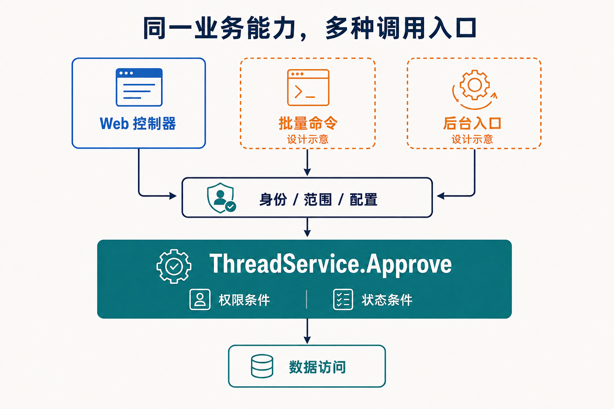

# 让业务能力跨宿主复用

某个论坛原来只允许版主通过 Web 界面审核主题。后来运维需要批量处理历史主题，合作系统也要接入审核流程。此时最有价值的复用对象，是已经定义好条件和结果的审核能力：新入口应继续遵守相同规则，并对自己的输入输出负责。

Zongsoft 把宿主、插件装配和业务服务分开，为这种复用提供基础。但服务移出控制器以后，身份、数据访问与生命周期等依赖仍然存在，需要明确接续。

## 从真实调用判断职责

当前 [ThreadController](https://github.com/Zongsoft/discussions/blob/main/src/api/Controllers/ThreadController.cs) 的审核操作调用 [ThreadService.Approve](https://github.com/Zongsoft/discussions/blob/main/src/Services/ThreadService.cs)，再把布尔结果映射为 HTTP 204 或 404。服务负责组合主题状态与版主资格条件，控制器负责路由和协议响应。相关实现见[请求与数据服务接口](../../framework/web/data-services.md)。

这次分离留下了一个可以复用的业务入口，也留下一个需要理解的返回值约定：返回假表示没有满足条件的更新，不能直接据此区分主题不存在、已经批准或不符合操作资格。新的命令入口若需要向操作者展示更细的原因，就应评估是否扩展业务结果契约，并同时考虑权限信息的暴露范围；不能由命令随意猜测失败原因。

## 依赖方向让复用成为可能

下面表示一种可采用的调用结构。Web 审核入口已经存在，批量命令和后台审核入口是说明复用方向的设计示意，不代表论坛已提供这些功能。

_各入口都需要接续身份、业务范围和配置，再调用审核服务。中间横栏表示共同的设计责任，不是框架新增的网关组件；虚线入口属于设计示意。_

各入口将外部输入转换为业务调用，并处理对应的输出方式。领域服务不应反过来调用控制器生成响应，或要求终端模拟一个 HTTP 请求。项目引用也应体现这一方向：[Discussions.Web](https://github.com/Zongsoft/discussions/tree/main/src/api)适配领域能力，领域程序集保持其自身的依赖边界。

分层不需要为每个方法机械增加一层接口。现有论坛控制器直接使用具体数据服务；当跨模块消费者需要稳定契约，或确有多个实现需要替换时，再定义相应接口及其所有者。可维护性来自责任清楚，也来自避免无意义的转发层。

## 把调用所需的上下文接续完整

从 Web 入口进入服务时，应用已经建立认证主体和请求环境。换成命令或后台入口以后，这些条件不会自动出现。尤其是审核资格依赖当前调用者，不能因为运行在后台就默认拥有版主权限。

| 需要明确的内容 | Web 入口中的来源 | 新入口需要安排的事情 |
| --- | --- | --- |
| 调用身份 | 认证与授权流程 | 建立受信任的执行身份及对应权限 |
| 业务范围 | 请求参数及服务约束 | 明确站点、目标资源及允许处理的范围 |
| 配置与服务 | 插件宿主装配 | 部署领域依赖、配置连接并验证服务解析 |
| 完成与失败 | HTTP 响应 | 约定命令结果、任务记录及失败处理 |
| 中止与重试 | 请求生命周期 | 采用入口可支持的取消方式，并验证重复执行语义 |

表中描述的是设计责任，不表示当前所有服务方法都接收统一上下文参数或取消令牌。实现新入口时，应按现有 API 明确传递参数或建立执行上下文；需要补充契约时，把兼容性作为变更的一部分。

## 区分调用状态与组件生命周期

持续监听消息的入口可以由[工作器](https://github.com/Zongsoft/framework/blob/main/Zongsoft.Core/src/Components/IWorker.cs)管理启动与停止，再在每次收到消息时调用服务。[初始化器](https://github.com/Zongsoft/framework/blob/main/Zongsoft.Core/src/Services/IApplicationInitializer.cs)适合应用初始化阶段的装配工作。[工作台](https://github.com/Zongsoft/framework/blob/main/Zongsoft.Plugins/src/IWorkbenchBase.cs)参与宿主中的运行组件组织。它们分别解决不同阶段的问题，不能把长期任务塞进服务构造函数来代替生命周期管理。

共享服务还应避免保存“这一次审核”的主题编号和用户身份。服务可以被多个调用者复用，调用数据则应保持在明确的执行范围内。模块提供者不等于一次 Web 请求的作用域，具体约束见[服务定位与所有权](../../framework/core/services/locating.md)。

## 按生命周期决定状态放在哪里

同样是“审核状态”，可能指用户界面上选中的主题、一次批处理已经完成的条目，或数据库中正式批准的结果。这些状态应分别跟随交互、执行任务和持久业务数据的生命周期，而不是都放进一个共享模块实例。

例如拟新增的批量审核入口若需要断点续办，可以设计持久任务记录保存进度，并在恢复时重新核验调用权限与目标状态。仅保存在工作器字段中的进度会随进程退出而丢失；恢复内存快照也不能撤销已经提交的审核结果。模块划分提供规则的归属，状态保存方式仍要按恢复要求设计。

## 通过两类验证确认复用

第一类验证直接针对业务结果：非版主是否被拒绝、重复批准是否满足约定、正文批准状态是否一致。这些验证应能在提供必要配置、身份和数据依赖后调用业务服务完成，无需仅为验证规则而启动完整 HTTP 管线。

第二类验证针对入口：控制器如何映射结果，命令如何取得身份，后台任务中断后如何恢复。新入口可以共用第一类验证，但仍需要自己的适配验证。这样才能判断一次变化是在改变业务规则，还是只改变业务的使用方式。

开发 HTTP 入口时遵守 [REST API 设计规范](https://github.com/Zongsoft/Guidelines/blob/main/zongsoft.rest-api.guidelines.md)，C# 实现遵守 [C# 编码规范](https://github.com/Zongsoft/Guidelines/blob/main/zongsoft.csharp.guidelines.md)。接下来可阅读[扩展契约](extension-contracts.md)，判断新能力应该通过服务调用、扩展集合还是事件协作。

## 延伸阅读

Elux 的[模型驱动](https://github.com/hiisea/elux/blob/main/docs/designed/model-driven.md)与[分层设计](https://github.com/hiisea/elux/blob/main/docs/designed/three-layered.md)讨论了业务逻辑与交互入口的关系；作者的[状态管理](https://www.cnblogs.com/hiisea/p/16695692.html)和[虚拟窗口](https://www.cnblogs.com/hiisea/p/16638875.html)文章也启发了对状态生命周期的讨论。本篇将问题放到服务端的身份、事务和宿主生命周期中分析；前端状态模型与 Zongsoft 数据模型的 API 不存在直接对应关系。
