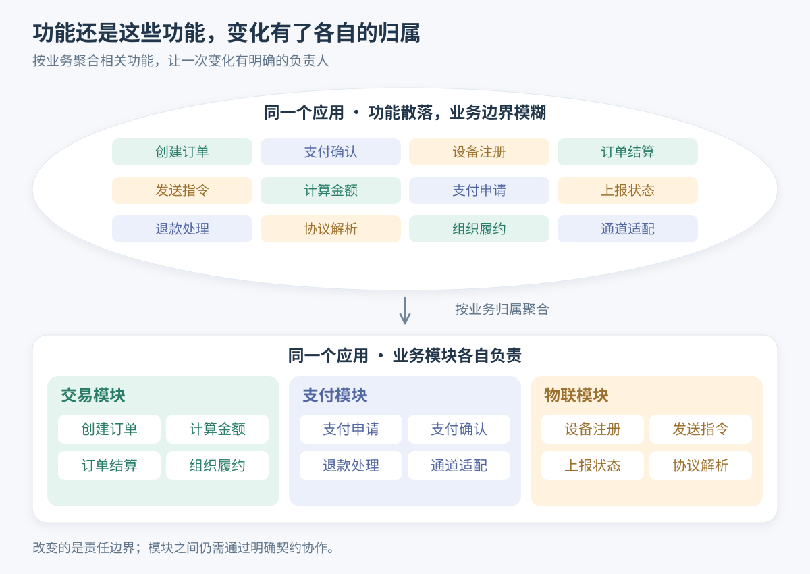
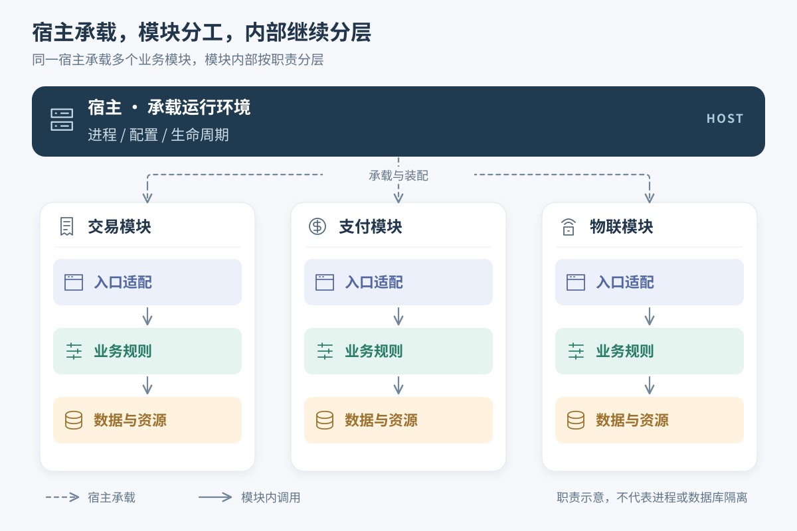
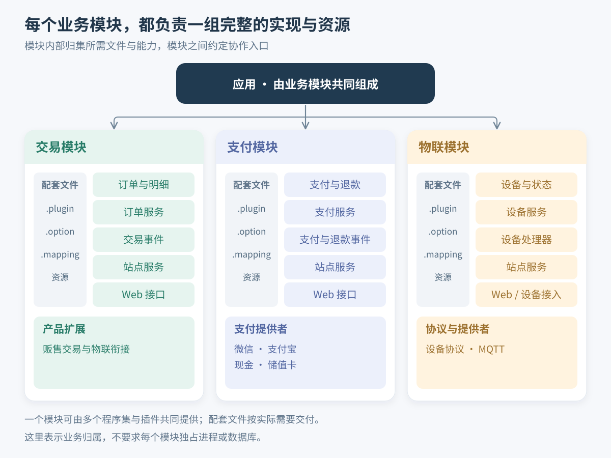
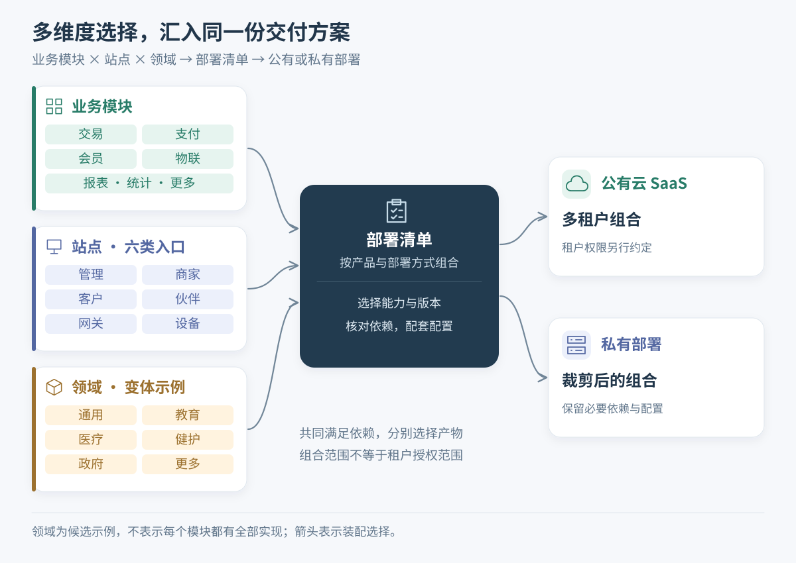

# 为什么需要插件化

消费者在机器前扫码、付款、取走商品，看起来只做了一件事：买东西。系统却要接连回答许多问题：订单属于哪个商家？用什么支付方式？外部平台的通知是否可信？钱已经付了，设备却没有应答，能不能重发出货指令？只出了一部分商品，该退多少钱？人工处理后，迟到的设备消息还能不能继续改变订单？

这还只是 **Automao** 的贩售场景。作为可以公有部署、也可以私有部署的商业 SaaS 系统，它还包含交易、支付、会员、物联、工单、营销、报表、统计、调查等业务模块；既有微信、支付宝等外部支付平台接入，也有现金、储值卡等支付方式；不同入口又面对平台管理员、商家员工、消费者或设备。

业务复杂并不可怕。可怕的是，**每增加一种支付方式、一个产品变体或一类入口，都需要重新理解半个系统**。插件化要解决的，就是怎样让这些变化各有归属，并让已经实现的能力能够重新组合。


本文结合 Automao 的模块目录、插件清单、处理器和业务流程资料提炼架构案例。Automao 是闭源商业系统，本文不提供它的外部链接、源码摘录或生产配置；文中的假设需求和组合示意，也不代表已经交付的产品套餐。


## 如果它是巨石系统：一场维护梦魇

假设我们把上述能力放进一个缺少业务边界的应用：所有模型归 `Models/`，所有服务归 `Services/`，所有控制器归 `Controllers/`；一套公共工具类谁都能调用，一张业务表谁都能修改。目录按文件职能摆得很整齐，却没有回答最关键的问题：**这条规则到底归谁负责？**

最初这通常很方便。支付成功就在回调里更新订单，顺手发出设备指令；需要积分，再补一次会员调用。每一笔小改动都能交差，但几年后，支付回调就成了交易、设备、会员和营销共同依赖的“总开关”。

### 改一个地方，要检查半个系统

现在要接入新的支付通道。开发者找到一段“更新支付状态”的代码，却不敢直接复用：它是否还会修改订单？是否假设某个支付平台的凭证格式？是否会触发出货？一次重复通知，会不会重复发货？

真正昂贵的不是多写几行适配代码，而是每次都要查清这些隐藏的前提。测试范围也跟着扩大：改的是通道，回归的却可能是整个购买流程。

### 想做局部重构，却找不到能取出来的一块

支付实现老了，想换掉；但交易服务直接使用它的内部类型，报表直接读取它的中间状态，设备回调又绕过服务更新它的数据。此时所谓“只重构支付”，实际上要求所有使用者同时配合。

业务不能停下来等一次大重写，开发者便继续往旧结构里补分支。代码越难改，越不敢改；越不敢改，下一次改动需要理解的历史就越多。维护梦魇往往是这样形成的。

### 客户只要一部分功能，却带走了整个系统

假设一位私有部署客户只需要基础交易和指定支付方式，不需要营销，也没有设备接入。如果购买流程写死了对这些能力的调用，“不显示菜单”就不等于“可以不部署”。删掉一个包，启动可能失败；保留所有包，又必须维护一批客户根本不用的配置和依赖。

再加上商家端与客户端的权限差异、产品定制和外部平台差异，散落的条件判断会越来越难盘点。复制一套代码可以暂时交付，却把下一次公共缺陷修复变成了多个客户版本的同步工作。



_图 1：上方功能散落，下方把同样的功能按业务归入交易、支付、物联模块。功能没有减少，应用也没有被拆成多个进程，变化的是规则的归属和协作边界。_


本文所说的“巨石”，指边界模糊、变化相互牵连的组织方式。**单体描述部署形态，模块化描述内部结构**：单体也可以有良好的模块边界，多个服务也可能高度耦合。`Models/` 等目录本身没有错，问题在于它们是否成了整个应用唯一的组织依据。


## 先横切一刀：分层而治

横向分层与纵向划分业务模块，是两种互补的拆分方式。在服务端，可以先按技术职责辨认三个层次：入口适配、业务规则、数据访问与资源。

入口负责理解外界的请求，业务负责决定允许发生什么，数据访问负责保存和读取结果。例如，“收到支付平台的通知”与“这笔支付是否可以从处理中变为成功”是两个问题，不能因为它们先后执行，就把它们写成无法分开的逻辑。

Automao 的支付接入能看到这样的分工：外部平台接入与支付提供者处理平台差异，把结果交给支付模块；支付模块声明支付、退款事件；交易后台插件把自己的处理器注册到支付成功事件上，负责后续订单处理。订单如何推进，便不必由每个支付通道各写一遍。

这里要保护的是**不同原因引起的变化**。支付平台调整通知格式，通常应落在平台适配处；订单结算规则调整，应落在交易服务或处理器里。业务规则也会频繁变化，分层并不是假设“业务永远稳定”，而是让协议变化不必顺带重写业务。



_图 2：宿主承载交易、支付、物联三个模块，每个模块保留入口适配、业务规则、数据与资源三个层次。虚线表示宿主承载与装配，实线表示模块内部调用方向；不表示进程或数据库隔离。_

## 再纵切一刀：按业务模块切块

只分层还不够。所有订单、退款、会员和设备规则如果仍然挤在同一个业务库里，开发者虽然知道去“业务层”找代码，却依然很难把支付完整地拿出来维护。

纵切要回答的是：**围绕一件业务，哪些规则、数据和资源应当一起负责？** 支付模块维护支付与退款的业务含义，交易模块维护订单与履约的业务含义，物联模块维护设备接入与通信。模块内部继续分层，模块之间通过明确的服务契约、事件或扩展点协作。

业务模块应把一个业务领域的代码和资源聚合起来，保持职责的完整性。划分模块不能只看文件数量：映射、参数、接入代码都留在别处，单独拆出的几个业务类仍然很难独立维护。

### 从业务模块到插件装配

在 Zongsoft 中，插件机制进一步把业务分工落实为运行时装配：`.plugin` 声明依赖、程序集与扩展挂载；相关程序集提供实现；需要时，配套的 `.option`、`.mapping` 和资源一起交付。并非每个插件都需要全部这些文件，也不是每个插件都要有自己的程序集。

以 Automao 的支付模块为例，可以辨认出三组协作产物：

- **基础能力**：支付、退款等模型、服务基类、模块定义与事件，以及相关映射和选项。
- **站点实现**：管理端、商家端、客户端各自的服务与 Web 接入，承担对应入口的授权、校验和可写性要求。
- **支付提供者**：微信、支付宝、现金、储值卡等实现。微信提供者依赖支付基础能力和微信平台集成，面向网关的清单再挂载支付与退款回调处理器。



_图 3：每个模块都归集完成本领域业务所需的实现与配套文件。中间的支付模块同时包含支付与退款模型、服务、事件、站点接入及支付提供者，对应上文三组协作产物。一个模块可以跨多个程序集和插件，图中的文件也不是每个插件都必须具备。_

因此，一个支付业务模块可以由基础插件、站点服务插件、Web 插件、提供者插件和后台插件共同组成。应用模块、程序集与插件的区别见[基础概念](../concepts.md#module-service-provider)。

新增通道时，优先实现提供者并补齐配置、依赖和部署项；只有通用契约不足以表达新通道的业务语义时，才需要协调修改核心契约。裁剪通道也要确认没有其他能力依赖它，并处理好存量支付和退款，而不是简单删除一个文件。

### 分开以后，一笔交易怎样完成

回到“钱已付，货还没出”的场景。支付负责确认钱的状态；交易负责判断订单能否推进并组织履约；设备接入负责指令发送与设备上报；贩售产品的扩展负责把这些通用能力放进具体产品流程。源码中的支付事件、交易处理器及贩售与物联的扩展目录，提供了这些分工的实际落点。

它们没有把业务链条切断，而是让每一段都有负责人。设备指令需要重试时，讨论可以从设备通信与履约衔接处开始，而不必让微信、支付宝、储值卡各维护一套出货重试逻辑。若要为会员增加某种购买奖励，应另行约定消费哪个业务事件，不能把“付款成功”自动当成“交易最终完成”。


事件让双方不必直接依赖彼此的具体实现，但不会自动保证消息可靠、处理幂等或跨模块事务一致。重复通知、部分出货、退款补偿和人工介入仍然需要明确设计。如何交付事件见[可靠投递与消息存储](../../framework/messaging/reliability.md)，如何处理数据一致性见[事务与一致性](../../framework/data/transactions.md)。


## 复杂度来自维度叠加，插件化让维度可组合

同一个“支付”功能，会同时遇到几种不同的问题：它属于哪个业务模块？给谁使用？接什么通道？在哪个产品中运行？部署到哪里？如果把这些问题都塞进支付服务的一串条件分支，服务就会逐渐承担整个产品的组合工作。

Automao 的组织方式提供了另一种观察角度：

| 维度 | 已有组织或场景 | 主要回答的问题 |
| --- | --- | --- |
| 业务 | 交易、支付、会员、物联、工单等模块 | 谁拥有规则，谁负责数据和行为 |
| 领域与站点 | `domain/default` 下的站点实现，以及公共、产品目录中的站点实现 | 哪些规则可以共享，哪些授权与接入行为需要区分 |
| 提供者与协议 | 支付提供者、设备协议和外部平台集成 | 如何适配外部系统的差异 |
| 产品 | 贩售产品的公共、支付、交易、物联及交叉扩展 | 哪些通用能力需要组合，哪些流程归产品负责 |
| 部署 | 不同宿主、运行环境及公有或私有部署要求 | 实际交付哪些产物，使用哪些配置和基础设施 |

这些维度可以分别组织，但**组合必须满足依赖关系**，并不是任意排列都能运行，也不意味着每个模块已经实现了所有领域和站点版本。

比如，一个贩售交付方案可能需要交易、支付、会员、物联和报表，再加入贩售自己的流程扩展。另一种私有部署方案，若业务允许，可以减少可选能力并选择指定支付提供者。相同业务规则继续复用，差异主要落在扩展、选项和交付清单中；客户定制也就不必一开始就复制整套业务代码。



_图 4：业务模块、站点与领域共同作为组合输入，由部署清单组织为公有云或私有部署。站点包括管理、商家、客户、伙伴、网关与设备六类入口；教育、医疗等领域为候选示例，不代表每个模块都已有对应实现。实际组合必须满足依赖关系，租户授权另行设计。_

这里还要区分两张“清单”：**部署清单决定把什么放进运行目录，插件清单决定这些产物如何接入应用**。`.deploy` 不等于租户功能授权，`.plugin` 的依赖声明也不会自动下载包。具体机制见[部署工具](../../tools/deployer.md)和[插件文件与加载](../../framework/plugins/plugin-file.md)。

公有 SaaS 中“某租户可以使用哪些能力”，还需要租户配置与权限规则；私有部署也仍然需要合适的数据、基础设施和运维方案。插件化提供组合的基础，不替代这些设计。

积木组合能更直观地说明这种复用：方块、长条、三角与半圆各有自己的形状，却可以搭出不同的整体。业务模块也是如此：交易、支付、会员等基础能力可以参与不同产品，产品再补上自己的流程与扩展。**复用的是模块所提供的能力，产品的差异则由选择、组合和扩展来表达。**


_图 5：相同类型的基础积木，形成不同的组合。这是组合复用的比喻，软件模块之间仍须遵守契约与依赖关系。_

## 把目录反过来：从职能分类到业务分类

当业务是第一层组织依据时，目录也应帮助开发者先找到业务，再找到实现职责。下面对照展示组织思路，省略无关文件；第二个示例按当前案例目录简化，不是完整部署模板。


```text
src/
	Models/       # 各种业务的模型集中在一起
	Services/     # 各种业务的服务集中在一起
	Controllers/  # 各种业务的控制器集中在一起
	Mappings/     # 各种业务的映射集中在一起
```



```text
modules/
	trading/
		abstraction/src/         # 模型、服务基类、事件、映射、基础插件
		domain/default/sites/    # 各站点的 src 服务与 api 接入
	paying/
		abstraction/src/
		domain/default/sites/
		providers/               # 微信、支付宝、现金、储值卡等实现
	things/
		abstraction/
		protocols/               # 设备协议
		providers/               # 物联提供者
products/
	vending/
		common/                  # 贩售产品公共能力
		paying/extensions/things/  # 产品中的支付与物联衔接
		trading/extensions/things/ # 产品中的交易与物联衔接
		things/                  # 贩售设备能力
hosting/                         # 承载、启动、配置与插件加载
```


这样，支付模型与支付映射虽然是不同类型的文件，却归同一项业务负责；设备协议变动有自己的落点；贩售特有的跨模块协作也有产品目录承接。`Models/`、`Services/` 等职能目录仍可保留在模块内部。

不过，移动目录只是把边界显现出来。**如果交易模块仍然随意修改支付内部状态，文件搬家并没有完成解耦。** 还需要用项目引用、公共契约、数据访问约定和评审把边界落实；也不要把所有跨模块逻辑重新堆进一个无限膨胀的“公共模块”。

## 插件化带来了哪些变化

衡量收益，最有用的办法是拿下一次业务变化来问：现在能否更快找到负责人，更准确地判断影响范围，更有把握地交付？

| 变化 | 缺少边界时 | 建立模块与装配边界后 |
| --- | --- | --- |
| 定位问题 | 支付异常要沿全局调用链查找 | 先区分通道、支付状态、交易衔接，再定位负责产物 |
| 渐进重构 | 实现细节四处被引用，替换要多人同时改 | 保持对外契约，先替换一个提供者或模块实现 |
| 产品组合 | 隐藏菜单后仍需带上整套依赖 | 按依赖选择能力，记录实际交付的版本与配置 |
| 跨入口复用 | 商家端、客户端各写一套公共规则 | 共享基础规则，在站点实现中保留权限与行为差异 |
| 交付验证 | 编译通过，却漏了映射、选项或处理器 | 把代码与配套元数据作为一个可验证的交付组合 |
| 团队协作 | 改动谁都沾边，验收没人全负责 | 模块有负责人，跨模块变化有明确的契约参与方 |

例如，在提供者契约不变时，可以先重构某个支付通道，再验证它与支付服务、网关和交易流程的衔接。范围仍然跨越必要的参与者，但不需要顺便重写会员或报表。这种**业务持续迭代时仍能逐块改进的能力**，比一开始就猜对所有需求更重要。


插件可以分别开发、打包，但不保证能无协调发布、独立回滚或不停机替换。同一宿主中的插件通常共享进程资源；程序集版本、公共契约、数据结构和运行状态都会限制升级方式。插件也不是安全沙箱，模块容器不提供租户隔离。交付边界见[从局部改造到可验证的插件交付](evolutionary-delivery.md)。


## 代价：插件化不是免费的

插件化减少的是无关变化的互相干扰，同时增加了一份明确的装配与协作工作：

- **契约要维护**：服务接口、事件含义、扩展路径和配置键被使用之后，就需要考虑兼容与迁移。
- **元数据要同步**：代码、插件清单、选项、映射和部署项必须共同演进；清单存在不等于里面引用的文件仍然有效。
- **组合要验证**：基础模块测试通过，还要检查实际产品组合能否启动、发现服务并完成关键业务流程。
- **粒度要节制**：本来必须一起修改、一起保证一致性的规则，拆得过细只会增加协调成本。模块变多不应成为设计成绩。

如果应用规则少、改动集中、维护周期短，简单分层可能已经足够。当你反复遇到“一个能力要被多个入口复用”“一个客户只需要部分功能”“一个通道想单独演进”时，才有了引入相应插件边界的具体理由。

对 Automao 这样的复杂系统，插件化的价值不在于消除交易、支付和设备协作本身的复杂性，而在于让开发者能说清：**这次变化归谁，经过什么契约影响别人，需要带着哪些产物一起验证。** 从一条真正需要变化的业务链开始划界，比先把整个系统拆成几十个插件更可靠。

## 延伸阅读

- 如何找到合适的切分位置：[从业务变化确定模块边界](business-boundaries.md)。
- 如何在不同入口复用能力：[让业务能力跨宿主复用](host-independent-business.md)。
- 如何约定模块间协作：[把扩展点设计成协作契约](extension-contracts.md)。
- 如何把组织方式落实到运行环境：[插件应用模型](../../framework/plugins/application-model.md)、[插件文件与加载](../../framework/plugins/plugin-file.md)。
